# Raport właściwości materiałów — Przydział Filipa (M5–M8)
## *Porównanie wybranych materiałów organicznych dla satelitów na niskiej orbicie*

**Autor:** Filip Zdrojewski  
**Data:** 2026-05-05  
**Materiały:** M5 Guma silikonowa/RTV · M6 Kompozyt polisiloksanowy · M7 Kevlar · M8 Mylar/BoPET

---

## 1. Wstęp

Niniejszy raport zawiera zestawienie kluczowych właściwości mechanicznych i termicznych czterech materiałów przydzielonych Filipowi w ramach pracy *„A comparison of selected organic materials for low orbiting spacecraft"*. Dane pochodzą z recenzowanych artykułów naukowych, kart katalogowych producentów oraz baz danych materiałowych.

Dla każdego materiału sporządzono cztery wykresy o identycznej strukturze:

| Wykres | Treść |
|--------|-------|
| **A** | Krzywa naprężenie–odkształcenie (T = 23 °C) |
| **B** | Wytrzymałość na rozciąganie vs. temperatura |
| **C** | Moduł Younga vs. temperatura |
| **D** | Przewodnictwo cieplne vs. temperatura |

---

## 2. M5 — Guma silikonowa / RTV

### 2.1 Charakterystyka materiału

Gumy silikonowe utwardzane w temperaturze pokojowej (RTV — *Room Temperature Vulcanizing*) to elastomery na bazie polidimetylosiloksanu (PDMS). Stosowane w kosmonautyce jako kleje, uszczelnienia i elementy tłumiące drgania (np. **RTV 566** firmy Momentive/GE). Charakteryzują się ekstremalną elastycznością, odpornością chemiczną i stabilnością w szerokim zakresie temperatur.

### 2.2 Właściwości mechaniczne

| Właściwość | Wartość | Jednostka | Źródło |
|---|---|---|---|
| Wytrzymałość na rozciąganie (UTS) | **2–10** (typowo 6) | MPa | AZoM ID:920; MatWeb Silicone RTV |
| Moduł Younga (E) | **1–5** | MPa | Elastomer — 3–4 rządy wielkości poniżej metali |
| Granica plastyczności (σ_y) | — | — | **Nie dotyczy** — elastomery nie mają granicy plastyczności |
| Wydłużenie przy zerwaniu | 100–800 (typowo **400**) | % | AZoM ID:920 |
| Odporność na pękanie K_IC | — | — | Elastomery opisywane energią rozdarcia, nie K_IC |
| Gęstość | **1 100–1 250** | kg/m³ | AZoM ID:920; MatWeb |

> **Charakter krzywej:** silnie nieliniowa, hipersprężysta (model Neo-Hookean / Mooney-Rivlin). Brak granicy plastyczności. Odkształcenie odwracalne do kilkuset procent.

### 2.3 Wykres A — Krzywa naprężenie–odkształcenie

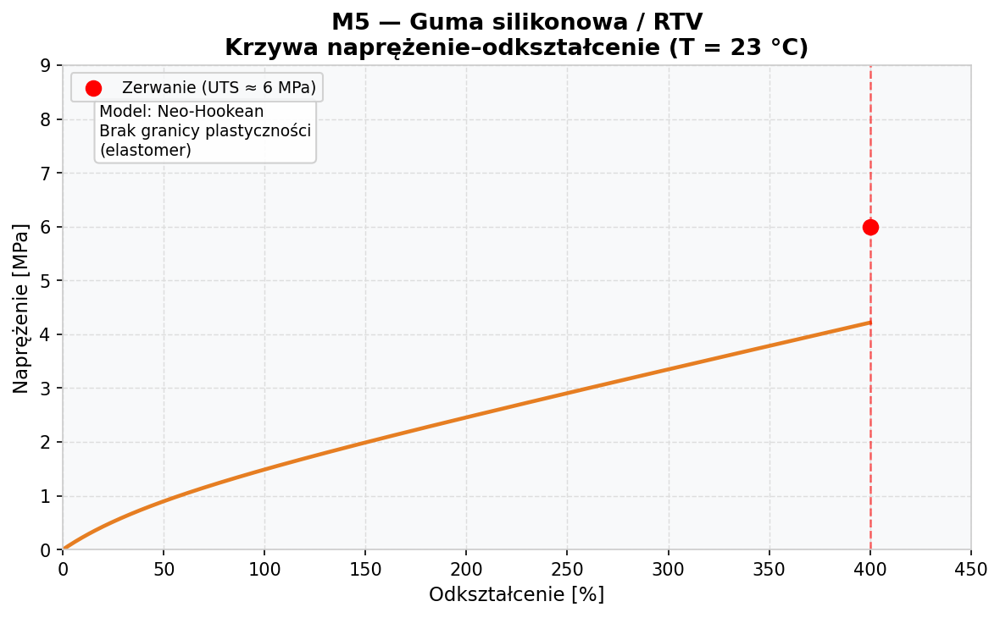

Krzywa wyznaczona dla T = 23 °C na podstawie modelu Neo-Hookean (G ≈ 0,85 MPa). Materiał zachowuje się jak sprężyna — brak granicy plastyczności, zerwanie przy odkształceniu ~400% i naprężeniu ~6 MPa.

### 2.4 Wykres B — Wytrzymałość na rozciąganie vs. temperatura

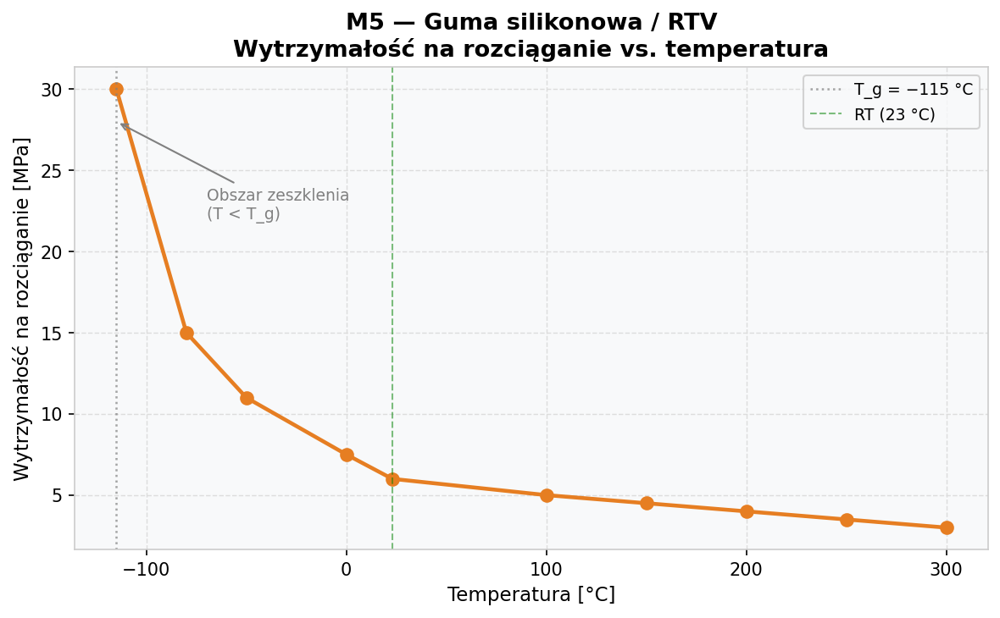

Poniżej T_g (−115 °C) materiał przechodzi w stan szklisty — wytrzymałość gwałtownie rośnie, ale maleje plastyczność. Powyżej temperatury otoczenia wytrzymałość stopniowo spada. Zakres pracy: −115 °C do +300 °C.

### 2.5 Wykres C — Moduł Younga vs. temperatura

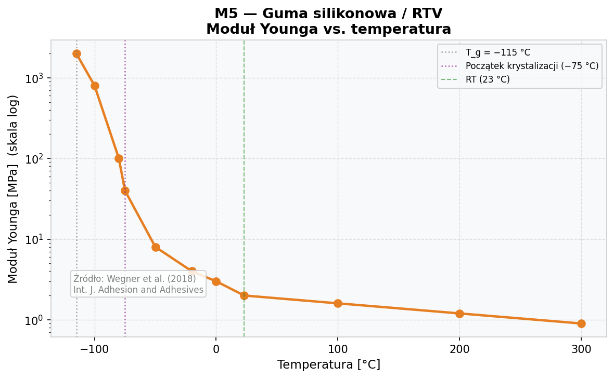

Dramatyczny wzrost modułu Younga w okolicach −75 °C (początek krystalizacji) — moduł rośnie nawet ~40-krotnie względem RT. Poniżej T_g (−115 °C) materiał staje się sztywny jak tworzywo sztuczne. Dane: Wegner et al. (2018).

### 2.6 Właściwości termiczne

| Właściwość | Wartość | Jednostka | Źródło |
|---|---|---|---|
| Przewodnictwo cieplne | **0,20–0,30** | W/m·K | Barucci et al., *Cryogenics* 38 (1998) |
| Pojemność cieplna właściwa | **1 300–1 500** | J/kg·K | Wegner et al. (2018) |
| Zakres temperatur pracy | **−115 do +300** | °C | Standardowe do +200 °C; T_g = −115 °C |

### 2.7 Wykres D — Przewodnictwo cieplne vs. temperatura

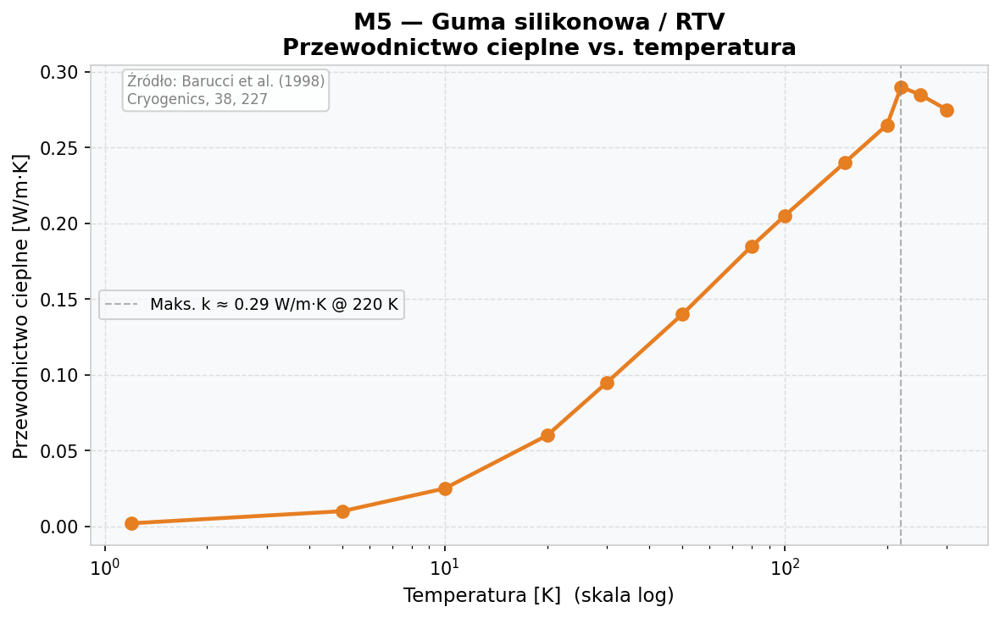

Dane z zakresu 1,2–300 K wg Barucci et al. (1998). Maksimum przewodnictwa (~0,29 W/m·K) osiągane jest w okolicach 220 K (−53 °C). Przy bardzo niskich temperaturach (poniżej 10 K) przewodnictwo spada do ~0,002 W/m·K.

### 2.8 Kluczowe źródła
- Barucci, M. *et al.* (1998). Thermal conductivity of a RTV silicone elastomer between 1.2 and 300 K. *Cryogenics*, **38**, 227. https://doi.org/10.1016/S0011-2275(97)00146-X
- Wegner, P. *et al.* (2018). Thermomechanical Behaviour of Aerospace-grade RTV. *Int. J. Adhesion and Adhesives*. https://doi.org/10.1016/j.ijadhadh.2018.07.012
- AZoM. Overview of Materials for Silicone Rubber. Article ID:920.
- SpaceMat Database. RTV 566. https://www.spacematdb.com

---

## 3. M6 — Kompozyt polisiloksanowy

### 3.1 Charakterystyka materiału

Matryce polisiloksanowe to żywice na bazie wiązań Si–O stosowane w kompozytowych układach ochrony termicznej (TPS). Podczas ogrzewania (300–550 °C) ulegają pirolizie, tworząc ceramiczną warstwę zwęgloną SiO₂/Si–O–C odporną powyżej 1200 °C. Kluczowe systemy:

- **CF/UHTR** (włókno węglowe / Ultra-High Temperature Resin) — Hou et al. / Techneglas
- **2,5D krzemionka/polisiloksan** — McDermott et al. 2022
- **SiO₂f/SiO₂** — z prekursora ceramicznego (PMC11945185, 2025)

### 3.2 Właściwości mechaniczne

| Właściwość | Wartość | Jednostka | Źródło |
|---|---|---|---|
| Wytrzymałość na rozciąganie (UTS) | **182 ± 9,6** | MPa | McDermott et al. (2022) |
| Moduł Younga (E) | **45 500** | MPa (45,5 GPa) | Hou et al., Techneglas |
| Granica plastyczności | — | — | Nie dotyczy — pęknięcie kruche |
| Wydłużenie przy zerwaniu | **0,97** | % | Hou et al., Techneglas |
| Odporność na pękanie K_IC | **2,52** | MPa·m⁰˒⁵ | PMC11945185 (2025) |
| Gęstość | **1 320** | kg/m³ | McDermott et al. (2022) |

### 3.3 Wykres A — Krzywa naprężenie–odkształcenie

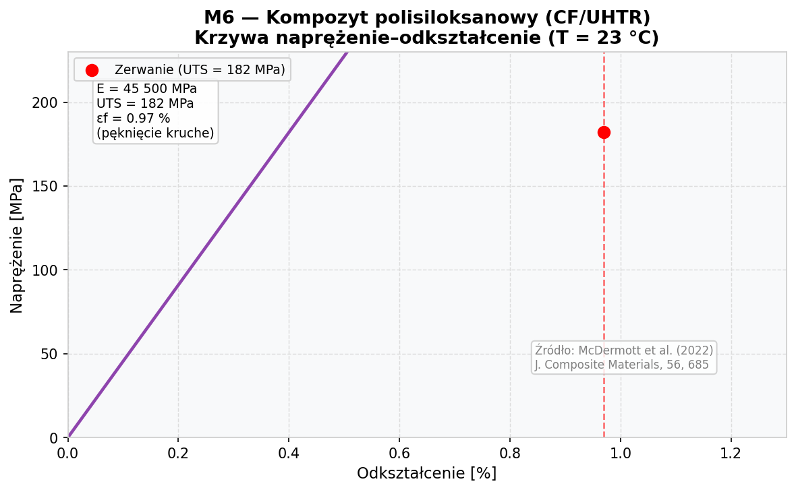

Liniowo-sprężysta do momentu nagłego pęknięcia (kruche). UTS = 182 MPa przy odkształceniu 0,97%. Brak granicy plastyczności. E = 45,5 GPa (CF/UHTR). Dane: McDermott et al. (2022); Hou et al., Techneglas.

### 3.4 Wykres B — Wytrzymałość na rozciąganie vs. temperatura

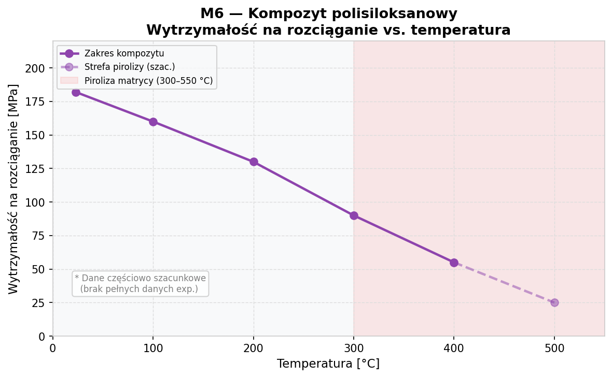

Wytrzymałość maleje wraz z temperaturą. Powyżej 300 °C rozpoczyna się piroliza matrycy — materiał przechodzi w ceramiczną warstwę zwęgloną (inna faza). Dane powyżej 300 °C są szacunkowe ze względu na zmianę charakteru materiału.

### 3.5 Wykres C — Moduł Younga vs. temperatura

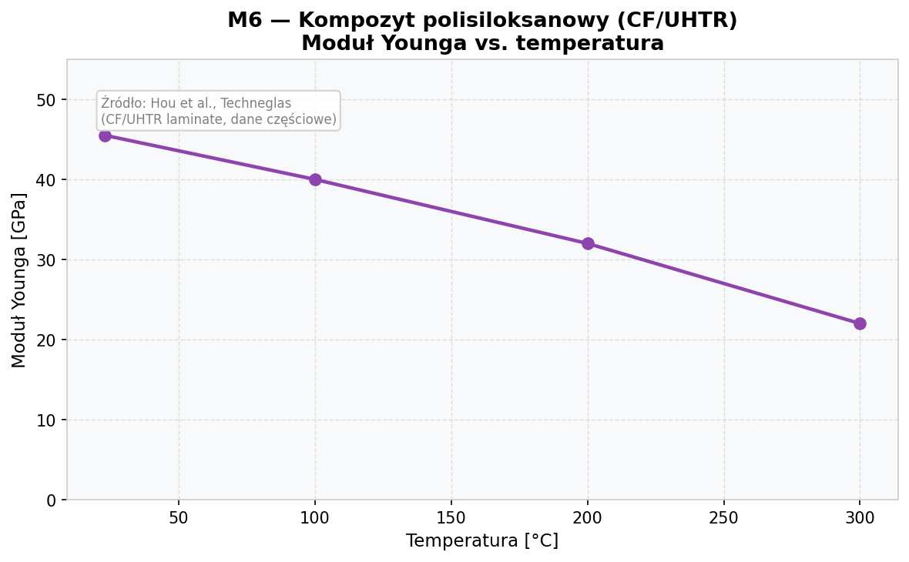

Moduł maleje z temperaturą. Dane dla układu CF/UHTR wg Hou et al. / Techneglas. Brak pełnych danych eksperymentalnych powyżej 300 °C — w tym zakresie materiał zaczyna pyrolizować.

### 3.6 Właściwości termiczne i ablacyjne

| Właściwość | Wartość | Jednostka | Źródło |
|---|---|---|---|
| Przewodnictwo cieplne (2,5D, RT) | **0,21** | W/m·K | McDermott et al. (2022) |
| Przewodnictwo cieplne (S/UHTR, 149–260 °C) | 0,63–0,65 | W/m·K | Tate et al., Techneglas |
| Pojemność cieplna właściwa | ~1 300–1 500 | J/kg·K | Szacunek na podst. danych krzemowych |
| Temp. pracy (faza char) | do **+1 400** | °C | Piroliza 300–550 °C; char > 1 200 °C |
| Szybkość ubytku masy (F1) | **0,021** | g/s | Tate et al., Techneglas |
| Prędkość recesji liniowej (F1) | **0,031** | mm/s | Tate et al., Techneglas |
| Uzysk węgla — żywica UHTR (TGA, 1000 °C) | **86,5** | % | Hou et al., Techneglas |

### 3.7 Wykres D — Przewodnictwo cieplne vs. temperatura

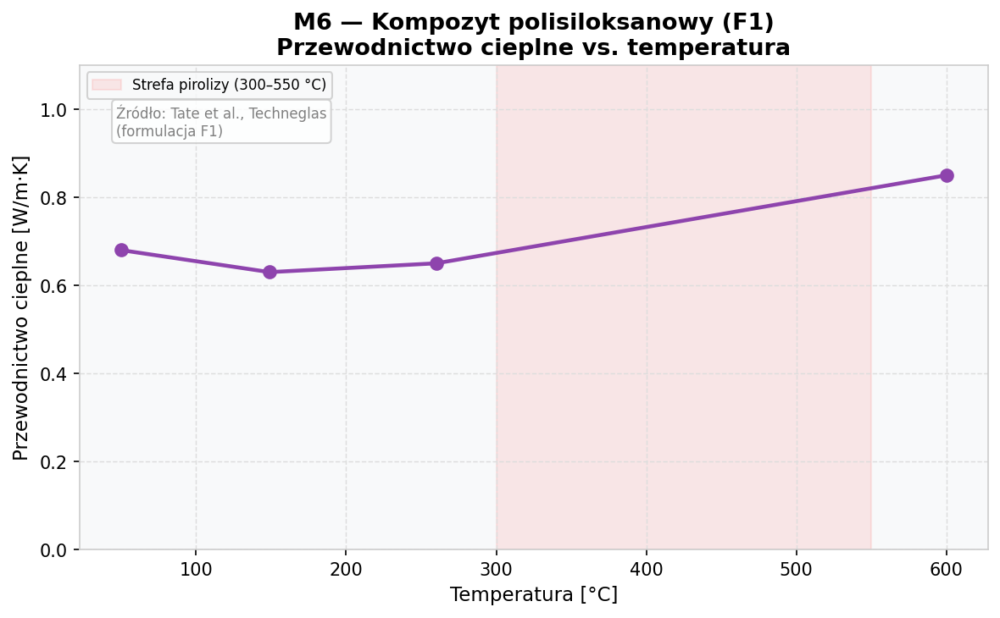

Dane dla formulacji F1 wg Tate et al. (Techneglas). Przewodnictwo jest relatywnie stabilne w zakresie 50–260 °C (~0,63–0,68 W/m·K), a powyżej strefy pirolizy (> 550 °C) rośnie ze względu na promieniowe przejście ciepła przez porowatą warstwę ceramiczną.

### 3.8 Kluczowe źródła
- McDermott, R.M., Tate, J.S., Koo, J.H. (2022). *J. Composite Materials*, **56**, 685. https://doi.org/10.1177/00219983211038622
- Hou, Y. *et al.* Performance of a Carbon Fibre/Polysiloxane Composite. Techneglas. https://www.techneglas.com
- Tate, J.S. *et al.* Experimental Characterisation of Novel Silica/Polysiloxane Ablative. Techneglas.
- PMC11945185 (2025). Performance Optimisation of SiO₂f/SiO₂ Composites. https://pmc.ncbi.nlm.nih.gov/articles/PMC11945185/

---

## 4. M7 — Kevlar® / Włókno aramidowe (Kevlar-29 i Kevlar-49)

### 4.1 Charakterystyka materiału

Kevlar® (DuPont) to para-aramidowe włókno syntetyczne. Dwie główne odmiany stosowane w kosmonautyce:

- **Kevlar-29** — standardowy, doskonała odporność na uderzenia i odłamki; stosowany w tarczach Whipple'a (MMOD)
- **Kevlar-49** — wysokomodułowy (~78% wyższy E niż K-29); stosowany w kompozytach konstrukcyjnych

**Oba gatunki są liniowo-sprężyste do momentu zerwania — brak granicy plastyczności. Zniszczenie nagłe i kruche z charakterystyczną fibrylacją.**

### 4.2 Właściwości mechaniczne

| Właściwość | Kevlar-29 | Kevlar-49 | Jednostka | Źródło |
|---|---|---|---|---|
| Wytrzymałość na rozciąganie (UTS) | **3 600** | **3 000–3 800** | MPa | MatWeb; DuPont Tech Guide |
| Moduł Younga (E) | **70–70,5** | **112–131** | GPa | MatWeb; DuPont datasheet |
| Granica plastyczności | — | — | — | **Nie dotyczy** — kruche włókno |
| Wydłużenie przy zerwaniu | **3,6** | **2,4** | % | DuPont; SubsTech |
| Odporność na pękanie K_IC | — | — | — | Nie scharakteryzowana klasycznie |
| Gęstość | **1 440** | **1 440** | kg/m³ | MatWeb; DuPont |

### 4.3 Wykres A — Krzywa naprężenie–odkształcenie

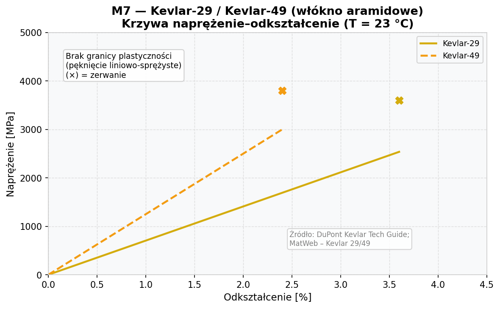

Obydwa gatunki wykazują zachowanie liniowo-sprężyste — brak granicy plastyczności. Kevlar-49 ma ok. 78% wyższy moduł (125 GPa vs 70,5 GPa) i nieco wyższą UTS, ale mniejsze wydłużenie (2,4% vs 3,6%). Zerwanie nagłe, oznaczone symbolem (×). Dane: DuPont Kevlar Tech Guide; MatWeb.

### 4.4 Wykres B — Wytrzymałość na rozciąganie vs. temperatura

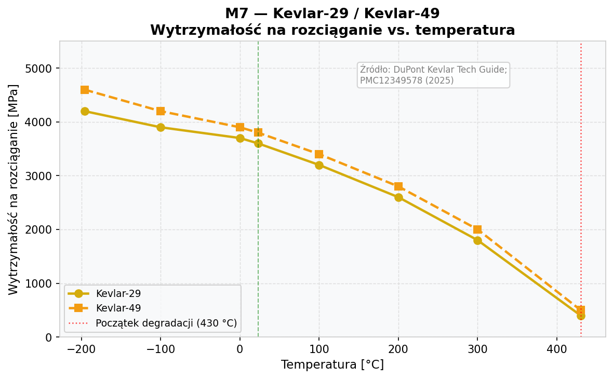

Kevlar zachowuje wysoką wytrzymałość w szerokim zakresie temperatur. Przy −196 °C (ciekły azot) wytrzymałość rośnie do ~4 200 MPa (K-29). Powyżej 300 °C następuje szybkie osłabienie, a degradacja rozpoczyna się ok. 430 °C. Dane: DuPont Kevlar Tech Guide; PMC12349578 (2025).

### 4.5 Wykres C — Moduł Younga vs. temperatura

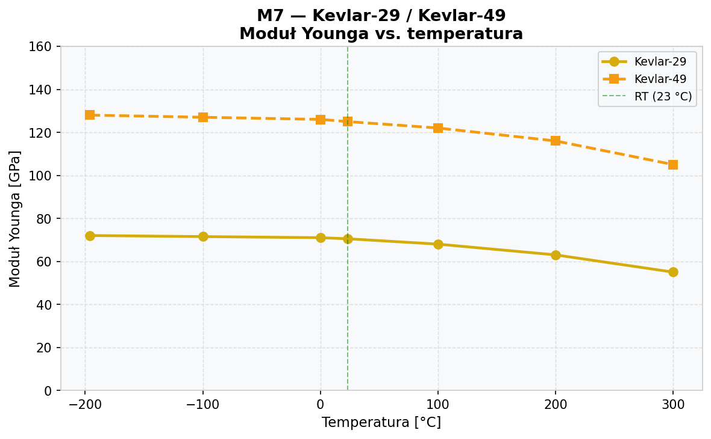

Obydwa gatunki wykazują umiarkowane zmiany modułu w zakresie −196 °C do +300 °C. Kevlar-49 pozostaje znacznie sztywniejszy (125 GPa przy RT) niż Kevlar-29 (70,5 GPa). Dane częściowo szacunkowe w oparciu o znane punkty z literatury.

### 4.6 Właściwości termiczne

| Właściwość | Wartość | Jednostka | Źródło |
|---|---|---|---|
| Przewodnictwo cieplne — poprzeczne (RT) | **0,04** | W/m·K | Ventura & Martelli, *Cryogenics* 2009 |
| Przewodnictwo cieplne — osiowe (RT) | **3,5–4,0** | W/m·K | Silna anizotropia |
| Pojemność cieplna właściwa | **1 420** | J/kg·K | material-properties.org/kevlar |
| Maks. temperatura pracy | **~430** | °C | Początek degradacji; DuPont |
| Min. temperatura pracy | **−196** | °C | Zachowuje właściwości przy LN₂ |

### 4.7 Wykres D — Przewodnictwo cieplne vs. temperatura

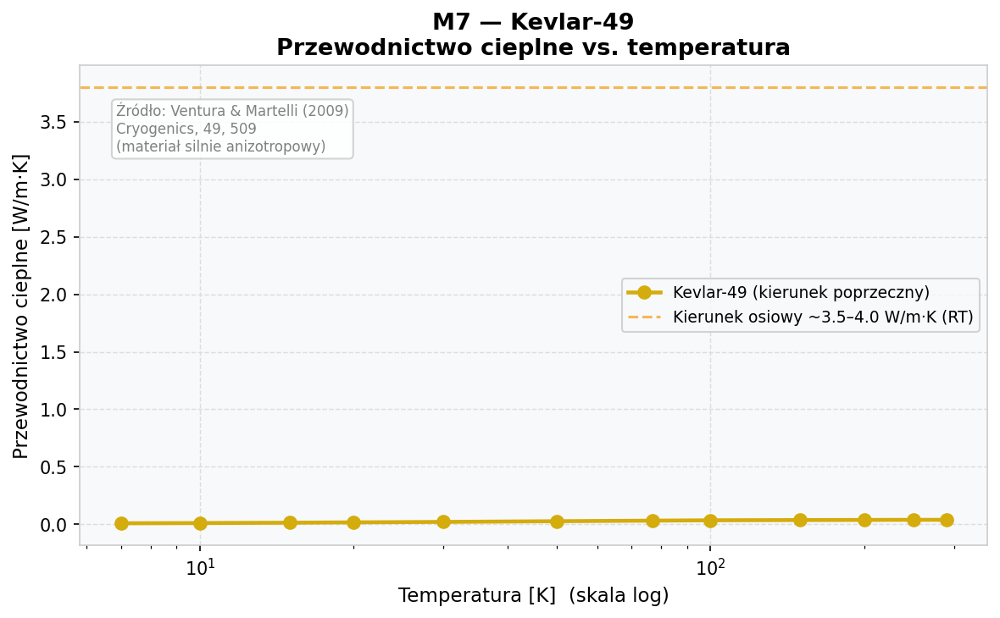

Dane w kierunku poprzecznym (prostopadłym do włókna) wg Ventura & Martelli (2009) dla zakresu 7–290 K. Przewodnictwo rośnie od ~0,01 W/m·K przy 7 K do ~0,04 W/m·K przy RT. Materiał jest silnie anizotropowy — w kierunku osiowym przewodnictwo wynosi ~3,5–4,0 W/m·K (linia przerywana).

### 4.8 Kluczowe źródła
- MatWeb. DuPont™ Kevlar® 29. https://www.matweb.com/search/datasheet.aspx?MatGUID=7323d8a43cce4fe795d772b67207eac8
- MatWeb. DuPont™ Kevlar® 49. https://www.matweb.com/search/datasheet.aspx?MatGUID=77b5205f0dcc43bb8cbe6fee7d36cbb5
- Ventura, G. & Martelli, V. (2009). Thermal conductivity of Kevlar 49 between 7 and 290 K. *Cryogenics*, **49**, 509. https://doi.org/10.1016/j.cryogenics.2009.03.006
- PMC12349578 (2025). Strain-Rate-Dependent Tensile Behaviour of Kevlar® 29. *Polymers*. https://pmc.ncbi.nlm.nih.gov/articles/PMC12349578/
- NIST Cryogenic Materials Database — Kevlar 49 Fiber. https://trc.nist.gov/cryogenics/materials/Kevlar49/kevlarfiber.htm

---

## 5. M8 — Mylar® / BoPET (Folia z politereftalanu etylenu orientowana dwuosiowo)

### 5.1 Charakterystyka materiału

Mylar® (DuPont Teijin Films) to folia z dwuosiowo orientowanego politereftalanu etylenu (BoPET). W kosmonautyce jest podstawową warstwą wielowarstwowej izolacji termicznej (**MLI** — *Multi-Layer Insulation*), często aluminizowanej. Stosowana w satelitach LEO jako pasywna kontrola termiczna (echo II — 1964; standardowe koce termiczne ISS).

### 5.2 Właściwości mechaniczne

| Właściwość | Wartość (MD) | Wartość (TD) | Jednostka | Źródło |
|---|---|---|---|---|
| Wytrzymałość na rozciąganie (UTS) | **190** | **210** | MPa | DuPont Teijin Mylar A (ASTM D882) |
| Moduł Younga (E) | **3 800** | **4 100** | MPa | DuPont Teijin Mylar A |
| Granica plastyczności (σ_y) | ~55–80 (bulk PET) | | MPa | AZoM ID:2047 |
| Wydłużenie przy zerwaniu | **115–140** | **120–160** | % | DuPont Teijin Mylar A |
| Odporność na pękanie K_IC | ~2–5 (szac.) | | MPa·m⁰˒⁵ | Szacunek na podst. bulk PET |
| Gęstość | **1 390–1 400** | | kg/m³ | DuPont Teijin; FSRI Materials DB |

> MD = kierunek maszynowy, TD = kierunek poprzeczny

### 5.3 Wykres A — Krzywa naprężenie–odkształcenie

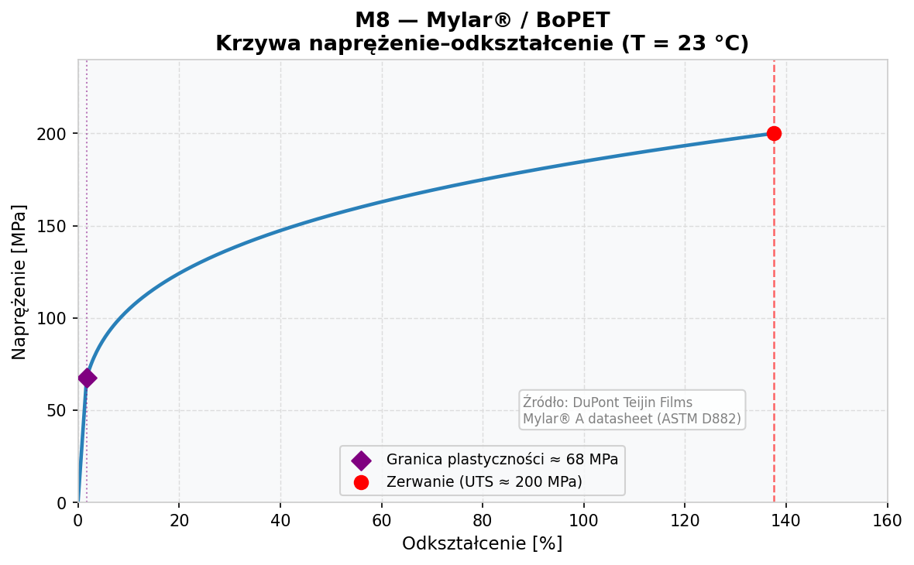

Zachowanie pół-ciągliwe typowe dla folii BoPET orientowanej dwuosiowo. Wyraźna granica plastyczności (~67,5 MPa), po której następuje umocnienie odkształceniowe aż do UTS = 200 MPa przy wydłużeniu ~137,5%. Model: wzmocnienie potęgowe (*power-law hardening*). Dane: DuPont Teijin Films Mylar A datasheet.

### 5.4 Wykres B — Wytrzymałość na rozciąganie vs. temperatura

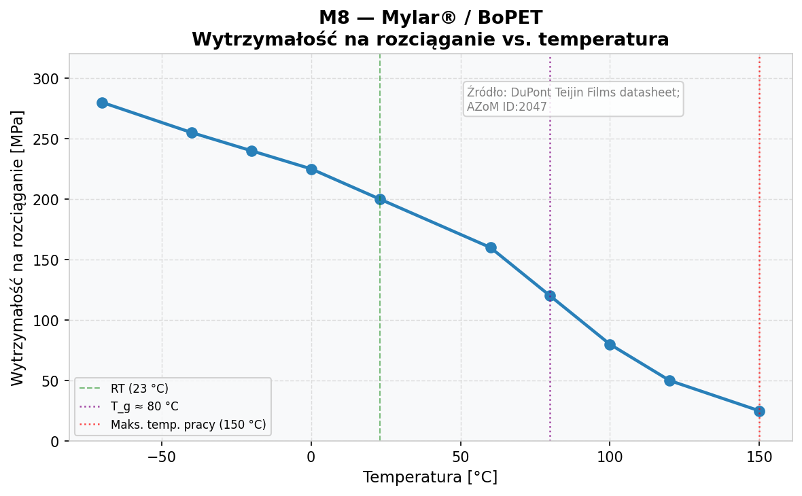

Wyraźny spadek wytrzymałości powyżej T_g (~80 °C). Przy −70 °C wytrzymałość rośnie do ~280 MPa. Powyżej 150 °C (maks. temperatura ciągłego użytkowania) materiał traci właściwości mechaniczne. Dane: DuPont Teijin Films datasheet; AZoM ID:2047.

### 5.5 Wykres C — Moduł Younga vs. temperatura

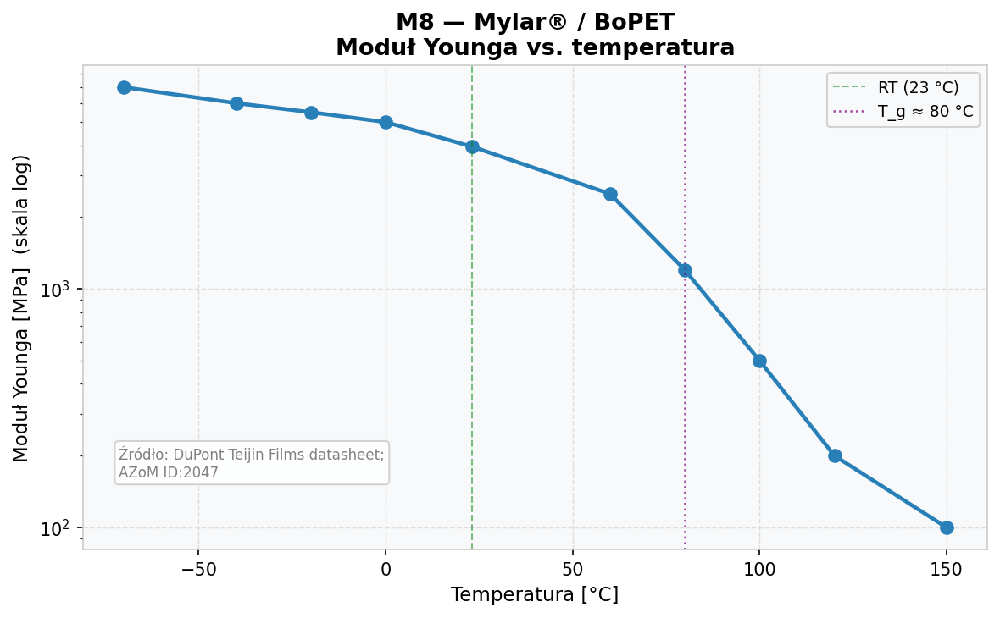

Dramatyczny spadek modułu przy przejściu przez T_g (~80 °C) — z ~4 GPa do poniżej 0,2 GPa w zakresie 80–150 °C (skala logarytmiczna). Poniżej 0 °C materiał znacznie sztywnieje (do ~7 GPa przy −70 °C). Dane: DuPont Teijin Films datasheet; AZoM ID:2047.

### 5.6 Właściwości termiczne

| Właściwość | Wartość | Jednostka | Źródło |
|---|---|---|---|
| Przewodnictwo cieplne | **0,14–0,16** | W/m·K | Thermtest; Professional Plastics |
| Pojemność cieplna właściwa | **1 200–1 350** | J/kg·K | FSRI Materials DB; AZoM ID:2047 |
| Temperatura zeszklenia (T_g) | **78–85** | °C | AZoM; NETZSCH |
| Temperatura topnienia | **254–260** | °C | AZoM; NETZSCH |
| Maks. temperatura ciągłej pracy | **+150** | °C | DuPont Teijin; UL 746B |
| Min. temperatura pracy | **−70** | °C | DuPont Teijin; raport OSTI |

### 5.7 Wykres D — Przewodnictwo cieplne vs. temperatura

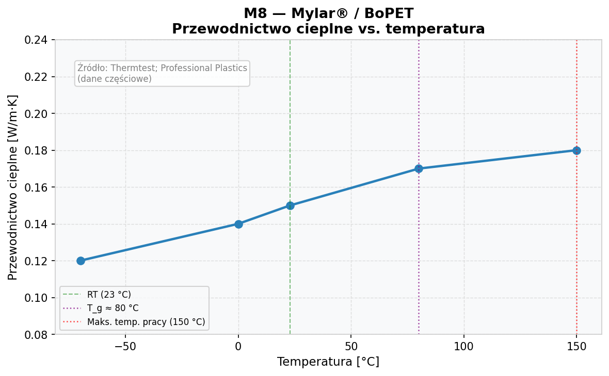

Przewodnictwo cieplne Mylaru jest stosunkowo stabilne i niskie w całym zakresie pracy (0,12–0,18 W/m·K). Nieznacznie rośnie z temperaturą. Zaznaczono T_g (80 °C) i maks. temperaturę pracy (150 °C). Dane: Thermtest; Professional Plastics.

### 5.8 Kluczowe źródła
- DuPont Teijin Films. *Mylar® A Physical & Thermal Properties* datasheet. https://usa.dupontteijinfilms.com
- MatWeb. DuPont Teijin Films Mylar® A, 500 Gauge. https://www.matweb.com
- AZoM. Properties of PET Polyester. Article ID:2047. https://www.azom.com/article.aspx?ArticleID=2047
- FSRI Materials Database. Polyethylene terephthalate (PET). https://materials.fsri.org
- Thermtest. Thermal conductivity of Mylar film. https://thermtest.com

---

## 6. Zestawienie porównawcze

| Właściwość | M5: Guma silikonowa | M6: Kompozyt polisiloks. | M7a: Kevlar-29 | M7b: Kevlar-49 | M8: Mylar/BoPET |
|---|---|---|---|---|---|
| **UTS [MPa]** | 2–10 | 13–182 | **3 600** | 3 000–3 800 | 190–210 |
| **Moduł Younga** | 1–5 MPa | 45,5 GPa | 70,5 GPa | 112–131 GPa | 3,8–4,1 GPa |
| **Granica plastyczności** | Brak | Brak | Brak | Brak | ~55–80 MPa |
| **Gęstość [kg/m³]** | 1 100–1 250 | 400–1 340 | 1 440 | 1 440 | 1 390–1 400 |
| **Przewodnictwo cieplne [W/m·K]** | 0,20–0,30 | 0,21 (2,5D) | 0,04 (poprzeczne) | 0,04 (poprzeczne) | 0,14–0,16 |
| **Pojemność cieplna [J/kg·K]** | 1 300–1 500 | ~1 300–1 500 | 1 420 | 1 420 | 1 200–1 350 |
| **Zakres temp. pracy [°C]** | −115 do +300 | do +1 400 (char) | −196 do +430 | −196 do +430 | −70 do +150 |
| **Odporność na pękanie [MPa·m^0.5]** | Brak (energia rozdarcia) | **2,52** | Brak | Brak | ~2–5 (szac.) |
| **Wydłużenie [%]** | 100–800 | 0,97 | 3,6 | 2,4 | 115–160 |
| **Charakter zniszczenia** | Elastomeryczny | Kruchy | Kruchy | Kruchy | Pół-ciągliwy |
| **Szybkość ubytku masy** | Brak | **0,021 g/s** | Brak | Brak | Brak |

---

## 7. Uwagi i ograniczenia

1. **M5 (Guma silikonowa RTV):** Właściwości silnie zależą od zawartości wypełniacza. Poniżej T_g (−115 °C) moduł wzrasta nawet 40-krotnie — kluczowe dla zastosowań kriogenicznych.

2. **M6 (Kompozyt polisiloksanowy):** Moduł Younga 45,5 GPa dotyczy układu CF/UHTR; UTS 182 MPa dotyczy kompozytu 2,5D SiO₂/polisiloksan. Są to różne systemy materiałowe — należy zestawić je oddzielnie przy pełnej analizie.

3. **M7 (Kevlar):** Podane wartości dotyczą pojedynczego włókna. Wartości dla laminatu są niższe ze względu na krymplowanie włókien i jakość interfejsu. Materiał silnie anizotropowy termicznie: 0,04 W/m·K (poprzecznie) vs ~3,5–4,0 W/m·K (osiowo).

4. **M8 (Mylar):** Właściwości dotyczą folii BoPET orientowanej dwuosiowo. Folia niestabilna powyżej T_g (~80 °C) — maks. temperatura ciągłej pracy to 150 °C. K_IC szacowane na podstawie danych dla bulk PET.

5. **Krzywe naprężenie–odkształcenie:** Wykresy A dla M5 i M8 opierają się na modelach konstytutywnych (Neo-Hookean, wzmocnienie potęgowe) skalibrowanych do znanych punktów (E, σ_y, UTS, εf) — nie są bezpośrednio digitalizowanymi danymi z jednego eksperymentu.

---

*Raport wygenerowano: 2026-05-05*  
*Wykresy: `Filip/plots/generate_plots.py`*  
*Dane źródłowe: `Filip/data/material_properties.py`*
