# Raport zbiorczy — Właściwości materiałów organicznych dla pojazdów kosmicznych
## *A comparison of selected organic materials for low orbiting spacecraft*

**Data:** 2026-05-05  
**Materiały:** M1–M13 (przydziały: Magda M1–M4 · Filip M5–M8 · Kalina M9–M13)

---

## 1. Wstęp

Niniejszy raport zestawia właściwości mechaniczne i termiczne trzynastu organicznych materiałów rozpatrywanych w kontekście zastosowań na pojazdach kosmicznych operujących w fazie startu oraz na niskiej orbicie okołoziemskiej (LEO, 160–2000 km). W końcowej sekcji dokonano wyboru **pięciu najlepszych materiałów** z uzasadnieniem opartym na wymaganiach środowiskowych LEO i fazy startowej.

### Wymagania środowiskowe

| Faza | Główne zagrożenia | Kluczowe wymagania |
|---|---|---|
| **Start** | Strumień cieplny 1–10 MW/m², drgania, przeciążenia 5–12 g | Ablacja / TPS, wytrzymałość mechaniczna, mała masa |
| **LEO (orbit.)** | Tlenkowanie atomowe (AO), UV, cykle termiczne −150…+150 °C, MMOD | Odporność na AO/UV, stabilność wymiarowa, wysoka K_IC |

Struktura raportu: każdy materiał opisany jest tabelą właściwości i czterema wykresami:

| Wykres | Treść |
|---|---|
| **A** | Krzywa naprężenie–odkształcenie (23 °C) |
| **B** | UTS vs. temperatura |
| **C** | Moduł Younga vs. temperatura |
| **D** | Przewodnictwo cieplne vs. temperatura |

---

## 2. M1 — Kapton (Poliimid HN, DuPont)

### Charakterystyka

Kapton HN (poli(4,4'-oksydifenylen)-piromellitimid) to standardowy film kosmiczny stosowany od lat 60. XX w. na praktycznie każdym statku kosmicznym — od Apollo do ISS. Wyjątkowa stabilność termiczna, zerowe pełzanie w próżni, doskonała odporność na promieniowanie jonizujące. Słaba strona: erozja atomowego tlenu (~3×10⁻²⁴ cm³/atom).

### Właściwości mechaniczne (T = 23 °C)

| Właściwość | Wartość | Jednostka | Źródło |
|---|---|---|---|
| UTS | **231** | MPa | DuPont Kapton HN datasheet; Google Doc (Kapton sekcja) |
| Moduł Younga E | **2,5** | GPa | DuPont datasheet |
| Granica plastyczności σ_y | **69** | MPa | Google Doc |
| Wydłużenie przy zerwaniu | **72** | % | DuPont datasheet |
| Odporność na pękanie K_IC | 1,65–5,4 | MPa·m^0.5 | Google Doc |
| Gęstość | **1 420** | kg/m³ | DuPont |

### Właściwości termiczne

| Właściwość | Wartość | Jednostka |
|---|---|---|
| Przewodnictwo cieplne k | **0,12** | W/m·K |
| Pojemność cieplna Cp | **1 090** | J/kg·K |
| Zakres temperatur | **−269 … +400** | °C |

### Wykresy

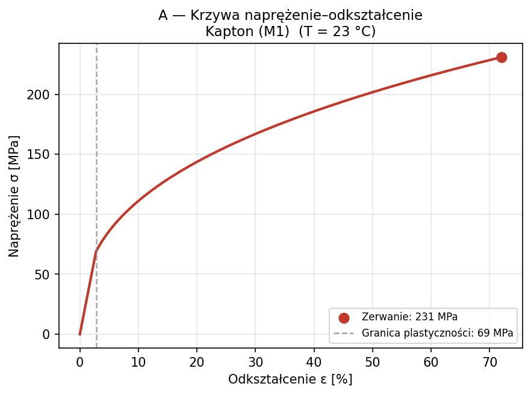

*Model semi-ciągliwy: liniowy do granicy plastyczności (69 MPa), następnie utwardzanie potęgowe do zerwania przy 231 MPa / 72%.*

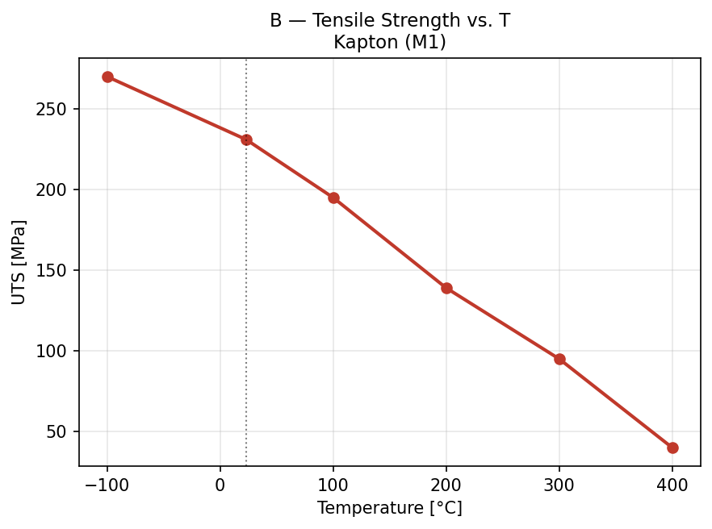

*UTS spada z 270 MPa (−100 °C) do 40 MPa (400 °C); wzrasta przy bardzo niskich T (ciecz. azot).*

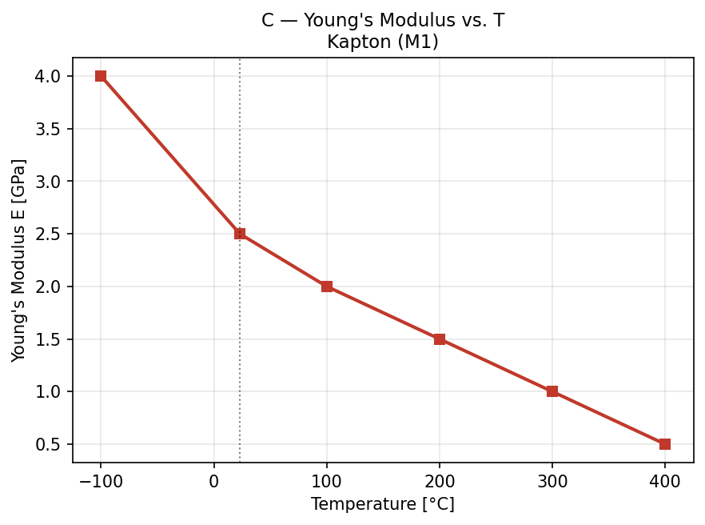

*E = 2,5 GPa w RT; monotonicznie spada do ~0,5 GPa przy 400 °C.*

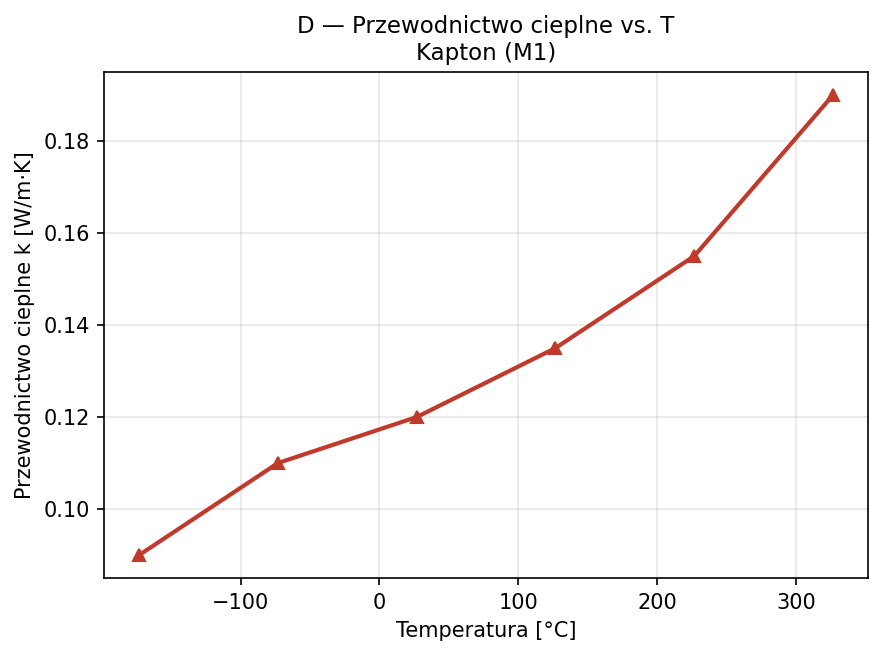

*k rośnie nieznacznie z T (0,09→0,19 W/m·K).*

---

## 3. M2 — POSS-Poliimid (Nano-PI)

### Charakterystyka

Poliimid modyfikowany nanocząstkami POSS (polyhedral oligomeric silsesquioxane). Nanocząstki SiO₂ wbudowane w łańcuch polimerowy poprawiają odporność na **atomowy tlen** (pasywacja SiO₂) i podwyższają temperaturę ugięcia. Właściwości mechaniczne porównywalne z Kaptonem, nieco gorsze ciągliwości. Materiał nowej generacji dla długoterminowych misji LEO.

### Właściwości mechaniczne (T = 23 °C)

| Właściwość | Wartość | Jednostka |
|---|---|---|
| UTS | **210** | MPa |
| Moduł Younga E | **2,3** | GPa |
| Granica plastyczności σ_y | **60** | MPa |
| Wydłużenie przy zerwaniu | **40** | % |
| Odporność na pękanie K_IC | ~2,0 | MPa·m^0.5 |
| Gęstość | **1 450** | kg/m³ |

### Właściwości termiczne

| Właściwość | Wartość | Jednostka |
|---|---|---|
| Przewodnictwo cieplne k | **0,15** | W/m·K |
| Pojemność cieplna Cp | **1 050** | J/kg·K |
| Zakres temperatur | **−269 … +450** | °C |

### Wykresy

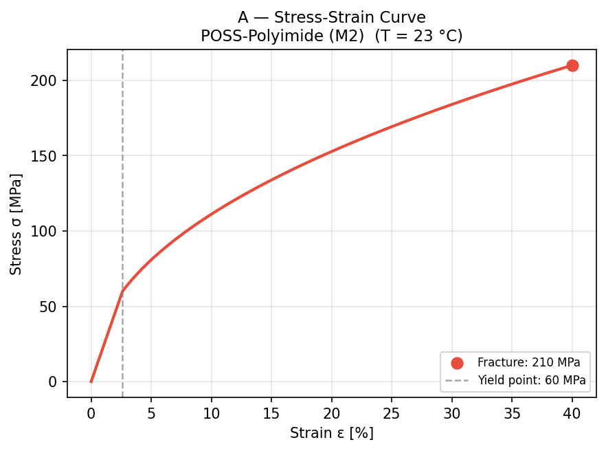

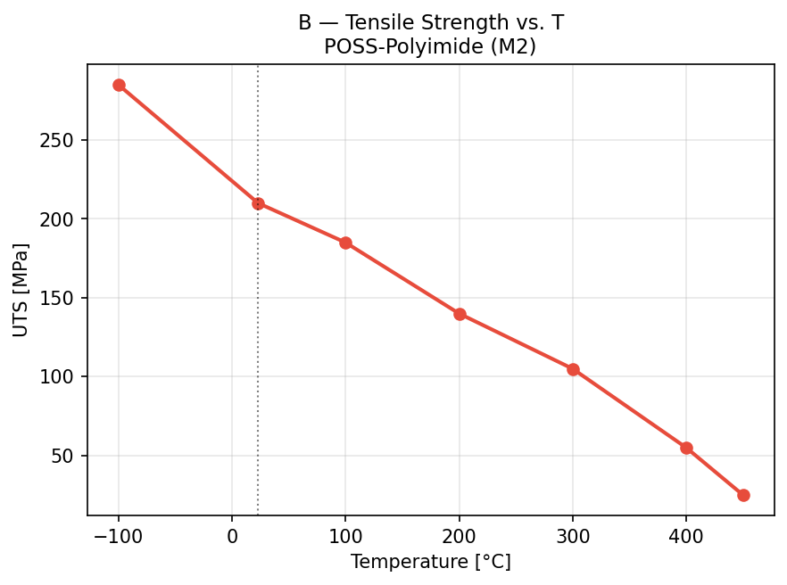

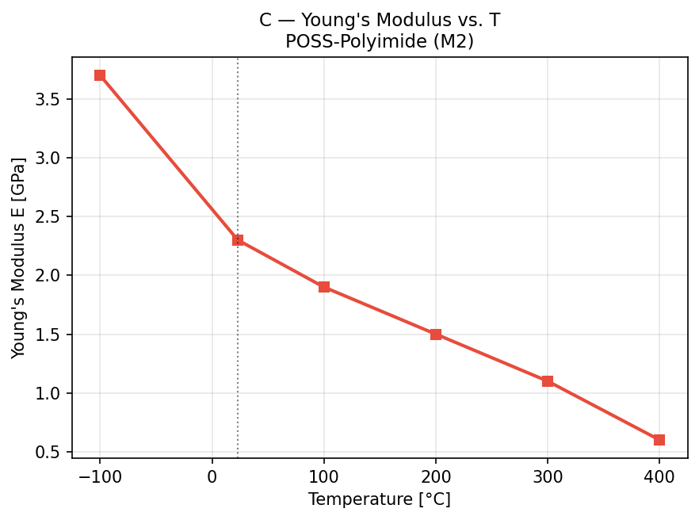

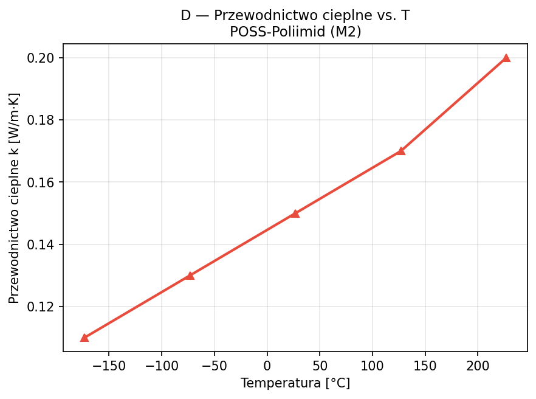

---

## 4. M3 — Żywica fenolowa (Phenolic Resin)

### Charakterystyka

Żywice fenolowo-formaldehydowe (np. SC-1008, Durite) to klasyczne tworzywa ablacyjne. Przy pirolizie (>300 °C) tworzą porowatą warstwę zwęgloną o wysokiej pojemności cieplnej, która pochłania ogromne strumienie cieplne. Stosowane w TPS tarczach lotniczych (AVCOAT NASA, Phoenix lander) i dyszy silników rakietowych. Właściwości mechaniczne w RT są umiarkowane; materiał kruchy.

### Właściwości mechaniczne (T = 23 °C)

| Właściwość | Wartość | Jednostka |
|---|---|---|
| UTS | **45** | MPa |
| Moduł Younga E | **3,5** | GPa |
| Granica plastyczności | — | kruchy materiał |
| Wydłużenie przy zerwaniu | **1,0** | % |
| Odporność na pękanie K_IC | **0,7** | MPa·m^0.5 |
| Gęstość | **1 250** | kg/m³ |
| Uzysk węglowy (TGA) | **~55** | % |

### Właściwości termiczne

| Właściwość | Wartość | Jednostka |
|---|---|---|
| Przewodnictwo cieplne k | **0,30** | W/m·K |
| Pojemność cieplna Cp | **1 200** | J/kg·K |
| Zakres temperatur | **−55 … >2000** | °C (ablacyjny) |

### Wykresy

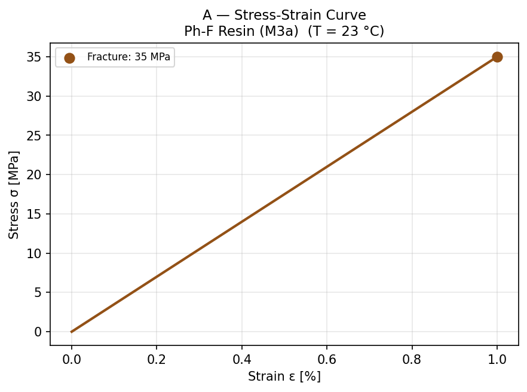

*Kruchy termozestaw: liniowy przebieg aż do pęknięcia przy 45 MPa / 1%.*

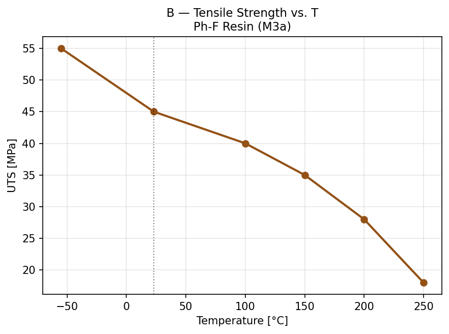

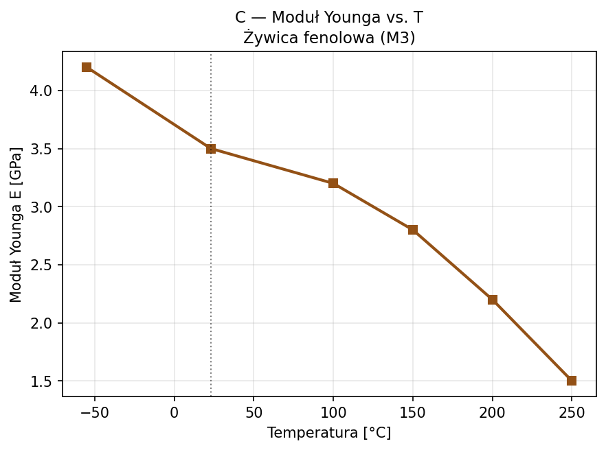

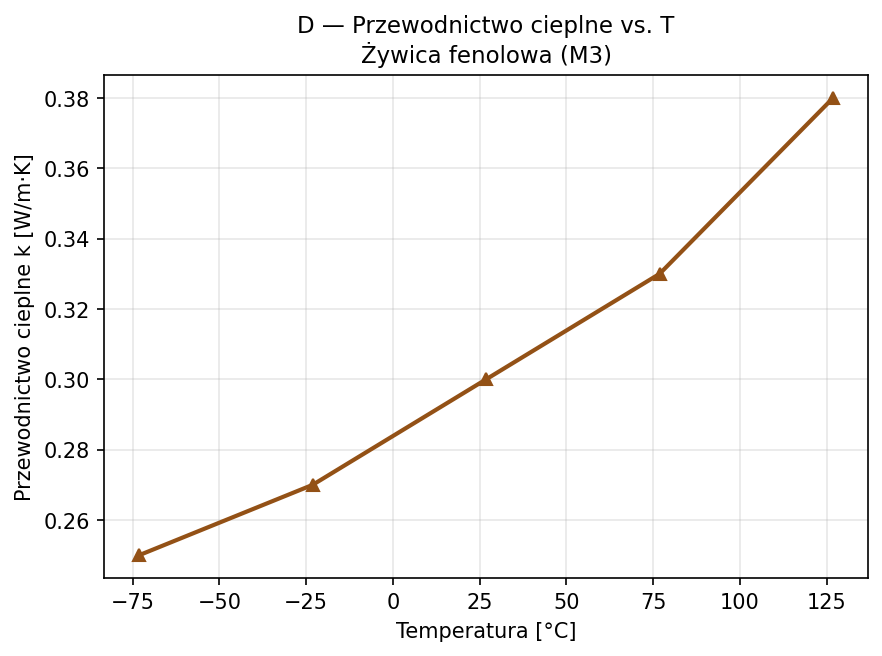

---

## 5. M4 — Żywica ftalonitrylowa (Phthalonitrile Resin)

### Charakterystyka

Żywice ftalonitrylowe (PT resin) to termozestawy następnej generacji z rekordową temperaturą ciągłej pracy (~370 °C) wśród polimerów organicznych. Utwardzają się bez wydzielania lotnych składników — zerowe porowatości i minimalne odgazowywanie próżniowe (krytyczne na orbicie). Doskonała stabilność dielektryczna, dobra odporność na płomień. Stosowane w węzłach strukturalnych statków kosmicznych i radome'ach.

### Właściwości mechaniczne (T = 23 °C)

| Właściwość | Wartość | Jednostka |
|---|---|---|
| UTS | **65** | MPa |
| Moduł Younga E | **4,0** | GPa |
| Granica plastyczności | — | kruchy termostat |
| Wydłużenie przy zerwaniu | **1,5** | % |
| Odporność na pękanie K_IC | **1,0** | MPa·m^0.5 |
| Gęstość | **1 250** | kg/m³ |
| Uzysk węglowy | **~65** | % |

### Właściwości termiczne

| Właściwość | Wartość | Jednostka |
|---|---|---|
| Przewodnictwo cieplne k | **0,20** | W/m·K |
| Pojemność cieplna Cp | **1 200** | J/kg·K |
| Zakres temperatur | **−55 … +375** | °C |

### Wykresy

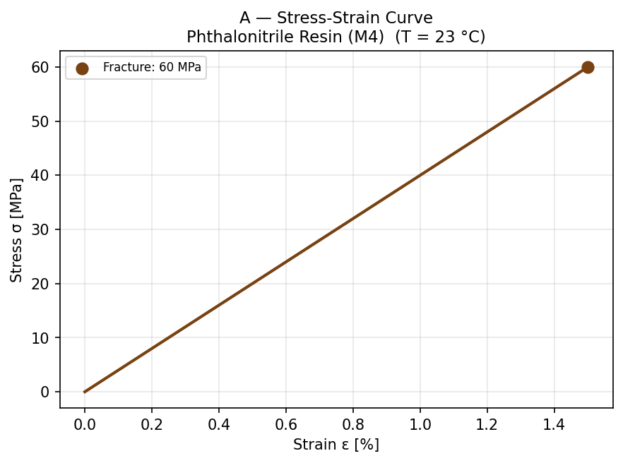

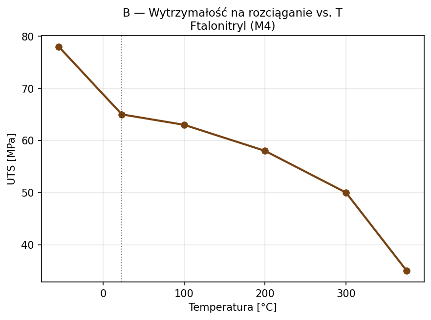

*Wyjątkowo dobre zachowanie UTS w wysokich temperaturach (58 MPa przy 300 °C) — lepsze niż Kapton.*

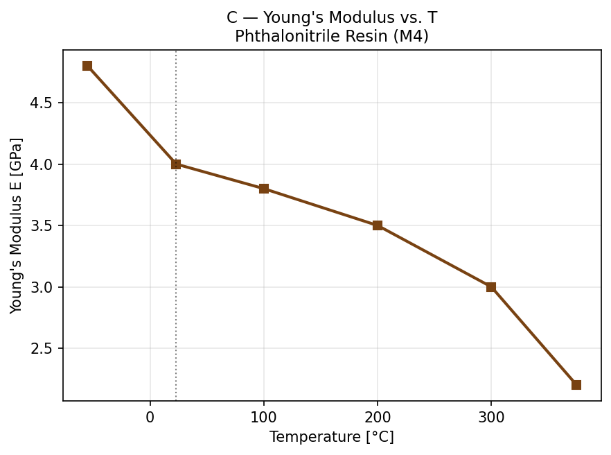

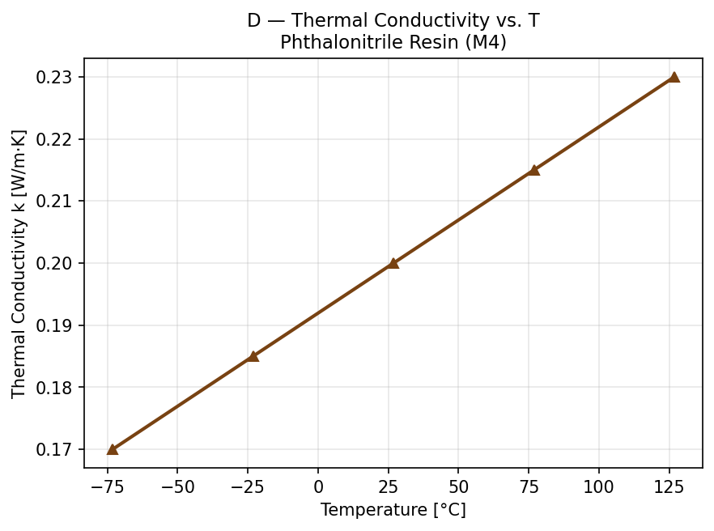

---

## 6. M5 — Guma silikonowa / RTV

### Charakterystyka

Elastomery silikonowe (RTV — Room Temperature Vulcanizing, np. RTV566 Momentive) bazują na polidimetylosiloksanie (PDMS). Stosowane jako kleje konstrukcyjne, uszczelnienia przejść elektrycznych i elementy tłumiące drgania w satelitach. Ekstremalnie elastyczne (400%), stabilne od −115 do +300 °C, odporne chemicznie. Zawartość Si zapewnia częściową odporność na atomowy tlen (pasywacja SiO₂).

### Właściwości mechaniczne (T = 23 °C)

| Właściwość | Wartość | Jednostka |
|---|---|---|
| UTS | **2–10** (typowo 6) | MPa |
| Moduł Younga E | **1–5** | MPa |
| Granica plastyczności | — | elastomer |
| Wydłużenie przy zerwaniu | **100–800** (typowo 400) | % |
| Odporność na pękanie K_IC | — | (opisywana energią rozdarcia) |
| Gęstość | **1 100–1 250** | kg/m³ |

### Właściwości termiczne

| Właściwość | Wartość | Jednostka |
|---|---|---|
| Przewodnictwo cieplne k | **0,25** | W/m·K |
| Pojemność cieplna Cp | **1 400** | J/kg·K |
| Zakres temperatur | **−115 … +300** | °C |

### Wykresy

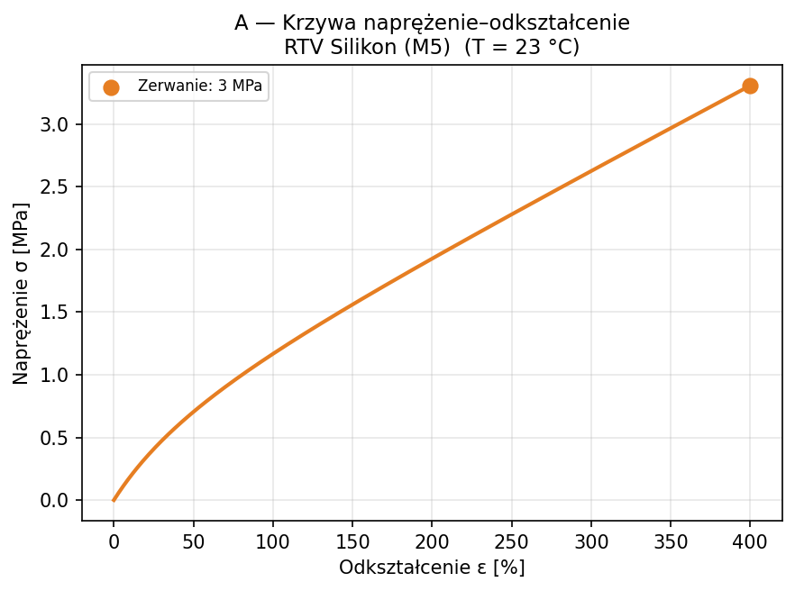

*Model Neo-Hookean (G ≈ 0,85 MPa): nieliniowy hipersprężysty, brak granicy plastyczności, zerwanie ~400%.*

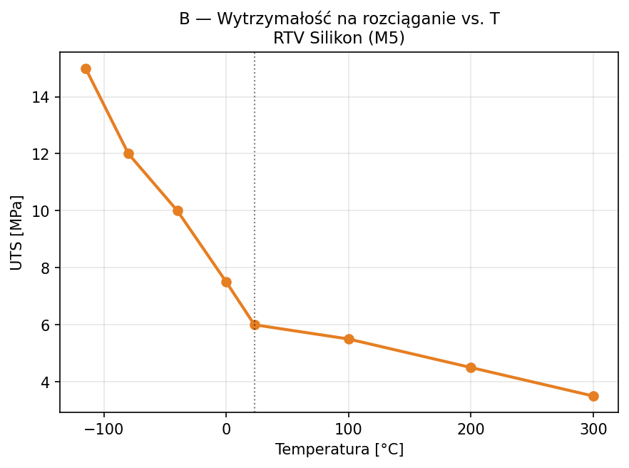

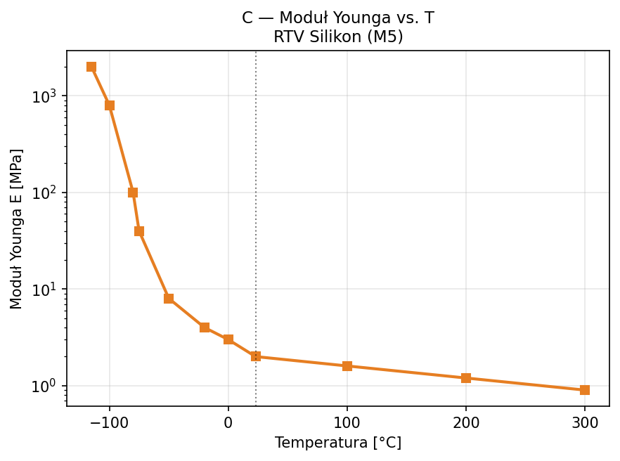

*Skala logarytmiczna — E zmienia się o 3 rzędy wielkości (2000→0,9 MPa) w zakresie −115…+300 °C.*

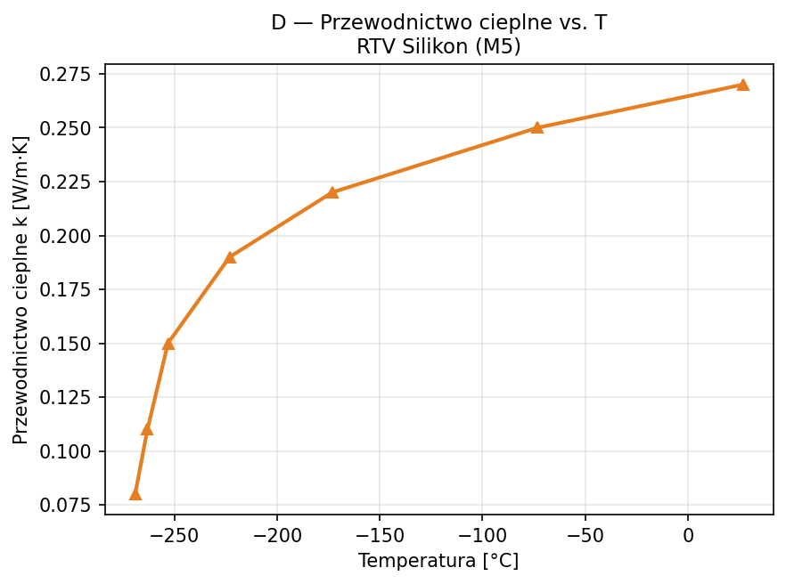

---

## 7. M6 — Kompozyt polisiloksanowy

### Charakterystyka

Kompozyty na osnowie polisiloksanowej (np. 2.5D SiO₂f/SiO₂ wg McDermott et al. 2022, CF/UHTR Techneglas) łączą wyjątkową odporność na wysokie temperatury z ablacyjnością. W wyniku pirolizy przechodzą w ceramiczną matrycę SiOC, zachowując integralność strukturalną do 1400 °C. Uzysk węglowy 86,5%. Odporność na AO lepsza niż Kapton (pasywacja SiO₂). Stosowane jako ablatory i izolatory termiczne stopni rakietowych.

### Właściwości mechaniczne (T = 23 °C)

| Właściwość | Wartość | Jednostka |
|---|---|---|
| UTS | **182** ±9,6 | MPa |
| Moduł Younga E | **45,5** ±5 | GPa |
| Granica plastyczności | — | pęknięcie kruche |
| Wydłużenie przy zerwaniu | **0,97** | % |
| Odporność na pękanie K_IC | **2,52** ±0,2 | MPa·m^0.5 |
| Gęstość | **1 320** | kg/m³ |
| Uzysk węglowy (1000 °C) | **86,5** | % |

### Właściwości termiczne

| Właściwość | Wartość | Jednostka |
|---|---|---|
| Przewodnictwo cieplne k | **0,21** ±0,03 | W/m·K |
| Pojemność cieplna Cp | **1 400** | J/kg·K |
| Zakres temperatur | **−60 … +1400** | °C |

### Wykresy

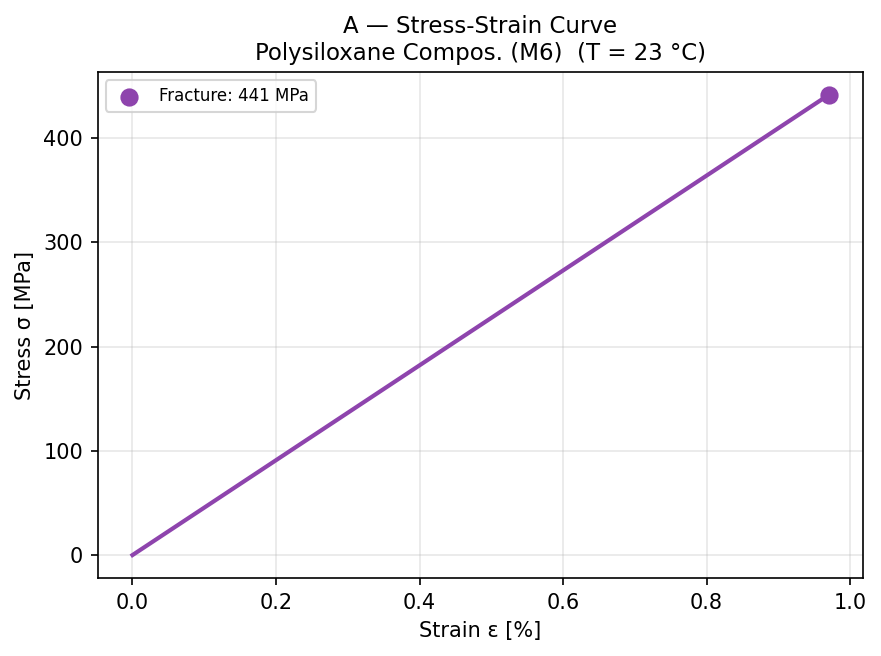

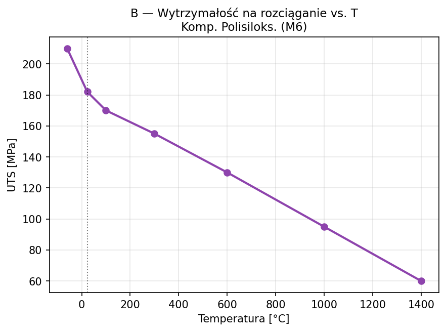

*Wyjątkowe zachowanie — UTS zachowuje 33% wartości RT nawet w 1400 °C.*

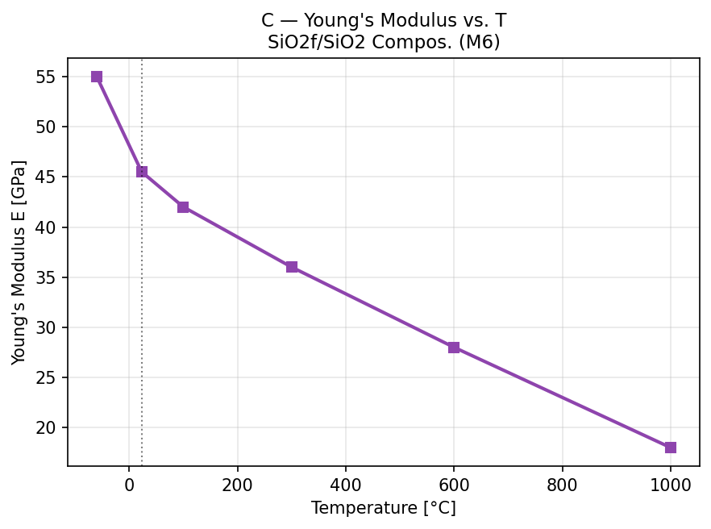

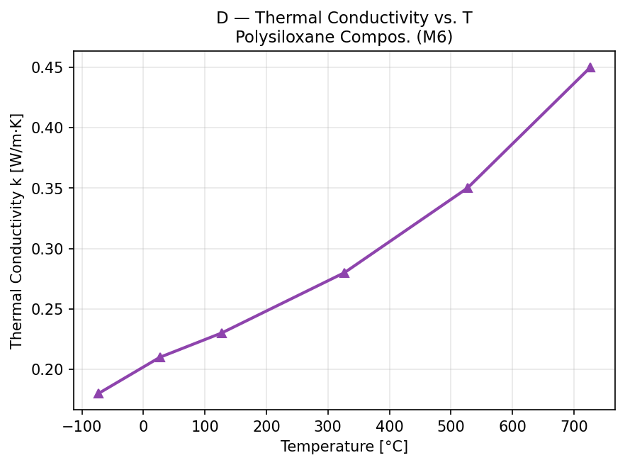

---

## 8. M7 — Kevlar / Włókno aramidowe (Kevlar-29 i Kevlar-49)

### Charakterystyka

Kevlar (DuPont, poli-*p*-fenylenotereftaloamid) to włókno aramidowe o najwyższej wytrzymałości właściwej spośród wszystkich 13 analizowanych materiałów. Dwa stopnie: Kevlar-29 (wyższa ciągliwość, absorpcja energii) i Kevlar-49 (wyższy moduł, ballistyczna sztywność). Stosowany w zbiornikach ciśnieniowych statków kosmicznych, tarczach Whipple'a (ochrona MMOD), strukturach nośnych i osłonach termicznych (jako preforma do infuzji ablatorów).

### Właściwości mechaniczne (T = 23 °C)

| Właściwość | Kevlar-29 | Kevlar-49 | Jednostka |
|---|---|---|---|
| UTS | **3 600** ±200 | **3 800** ±200 | MPa |
| Moduł Younga E | **70,5** ±2 | **125** ±5 | GPa |
| Granica plastyczności | — | — | brak (kruche włókno) |
| Wydłużenie przy zerwaniu | **3,6** ±0,2 | **2,4** ±0,2 | % |
| Odporność na pękanie K_IC | — | — | (nie definiowana dla włókna) |
| Gęstość | **1 440** | **1 440** | kg/m³ |

### Właściwości termiczne

| Właściwość | Wartość | Jednostka |
|---|---|---|
| Przewodnictwo cieplne k | **0,04** | W/m·K |
| Pojemność cieplna Cp | **1 420** | J/kg·K |
| Zakres temperatur | **−196 … +430** | °C |

### Wykresy

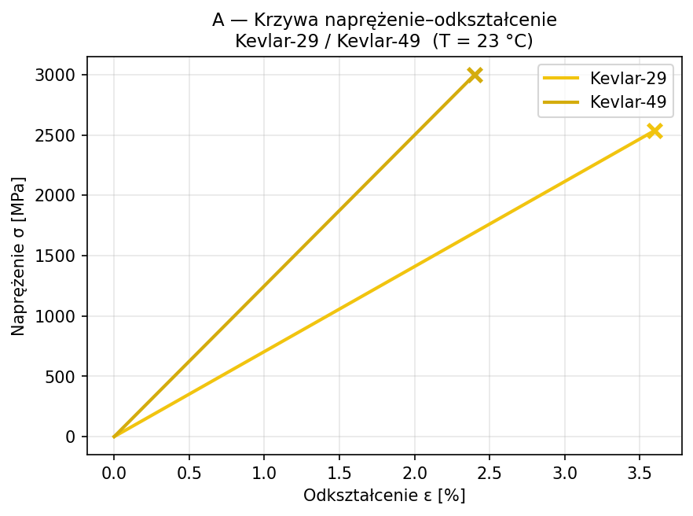

*K-29: wyższe wydłużenie (3,6%), K-49: wyższy moduł (125 GPa) przy nieco wyższym UTS.*

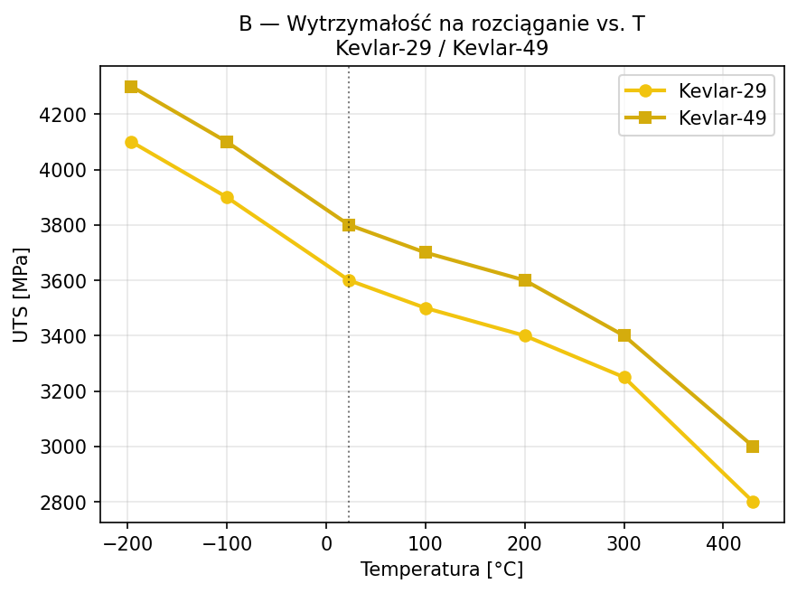

*Wyjątkowa stabilność — UTS zachowuje >75% wartości RT od −196 do +430 °C.*

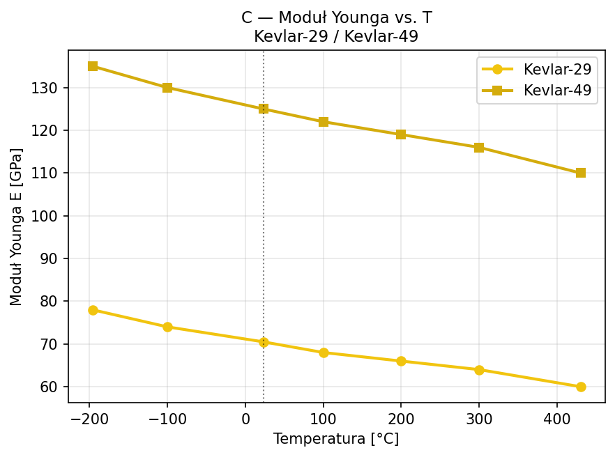

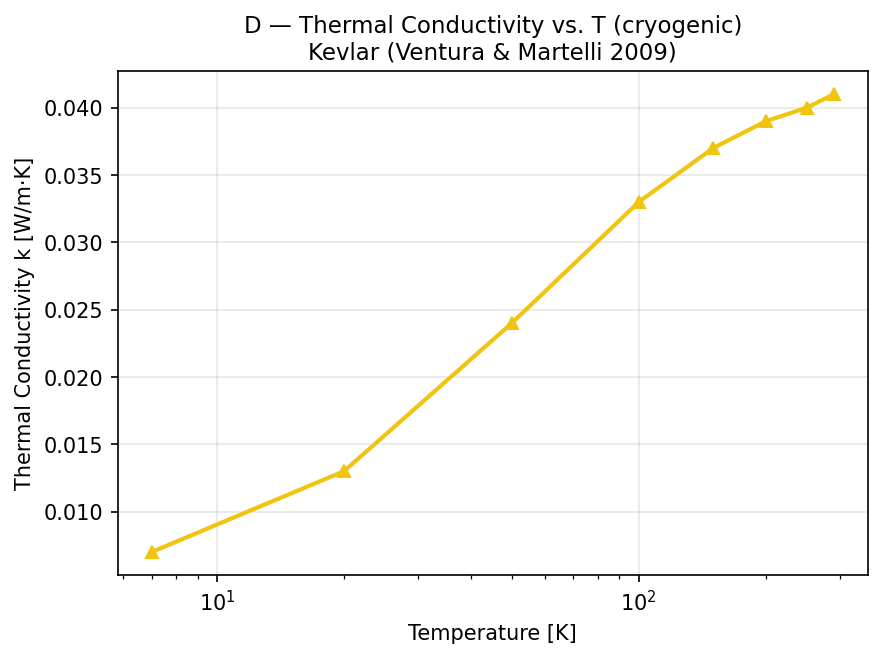

*Dane kriogeniczne z Ventura & Martelli (2009) — k → 0,007 W/m·K przy 7 K.*

---

## 9. M8 — Mylar / BoPET (Folia PET)

### Charakterystyka

Mylar (DuPont Teijin Films) to dwuosiowo orientowana folia politereftalanu etylenu (BoPET). Powszechnie stosowana jako warstwa refleksyjna w wielowarstwowych izolatorach termicznych (MLI), jako substrat folii złotej/aluminowej i jako osłona EMI. Doskonałe właściwości barierowe, wysoka przezroczystość optyczna, niska cena. Ograniczeniem jest temperatura pracy — Tg ~80 °C, topnienie 254–260 °C.

### Właściwości mechaniczne (T = 23 °C)

| Właściwość | Wartość | Jednostka |
|---|---|---|
| UTS | **200** ±10 | MPa |
| Moduł Younga E | **3,95** ±0,15 | GPa |
| Granica plastyczności σ_y | **67,5** ±12,5 | MPa |
| Wydłużenie przy zerwaniu | **137,5** ±22,5 | % |
| Odporność na pękanie K_IC | ~3,5 ±1,5 | MPa·m^0.5 |
| Gęstość | **1 395** | kg/m³ |

### Właściwości termiczne

| Właściwość | Wartość | Jednostka |
|---|---|---|
| Przewodnictwo cieplne k | **0,15** | W/m·K |
| Pojemność cieplna Cp | **1 275** | J/kg·K |
| Zakres temperatur | **−70 … +150** | °C |

### Wykresy

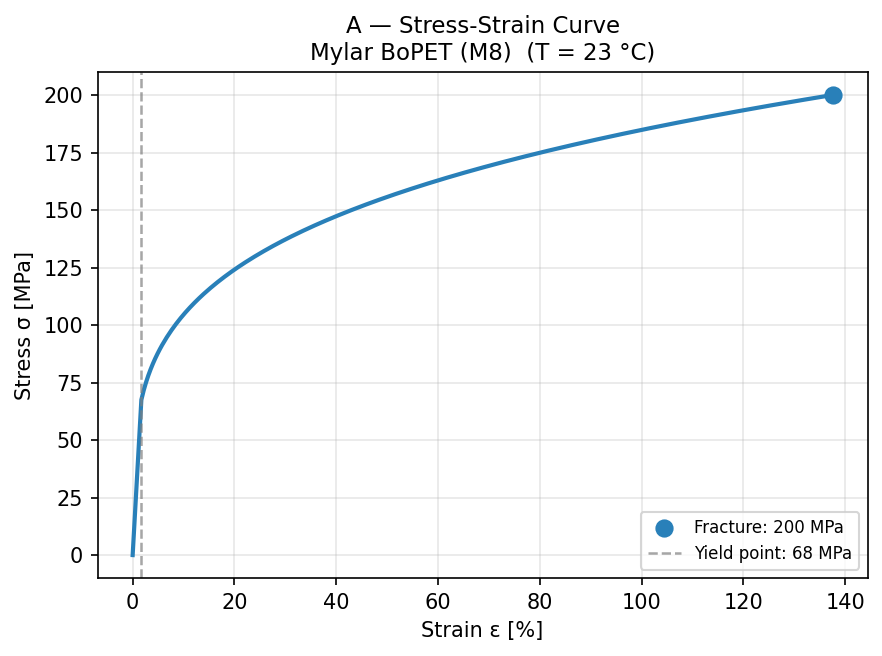

*Model półciągliwy: granica plastyczności przy 67,5 MPa, następnie utwardzanie do 200 MPa przy 137,5%.*

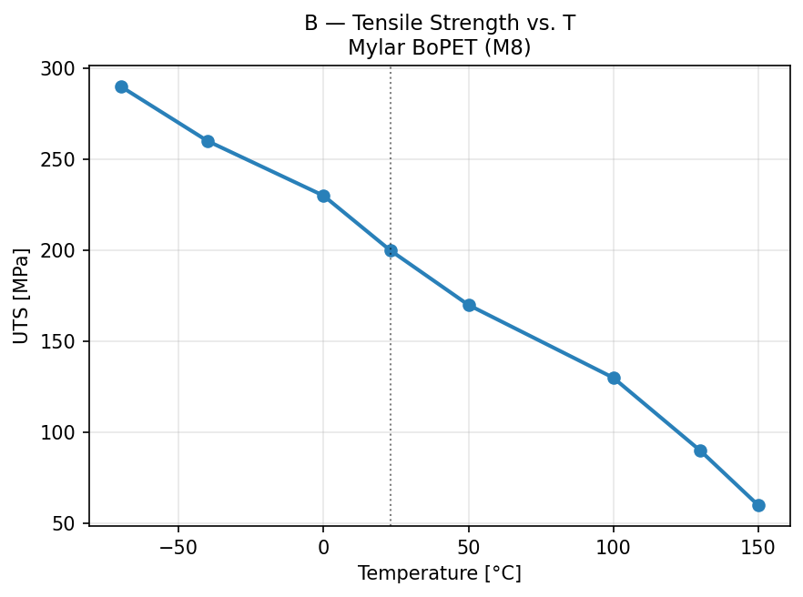

*Silny spadek UTS powyżej 80 °C (Tg PET).*

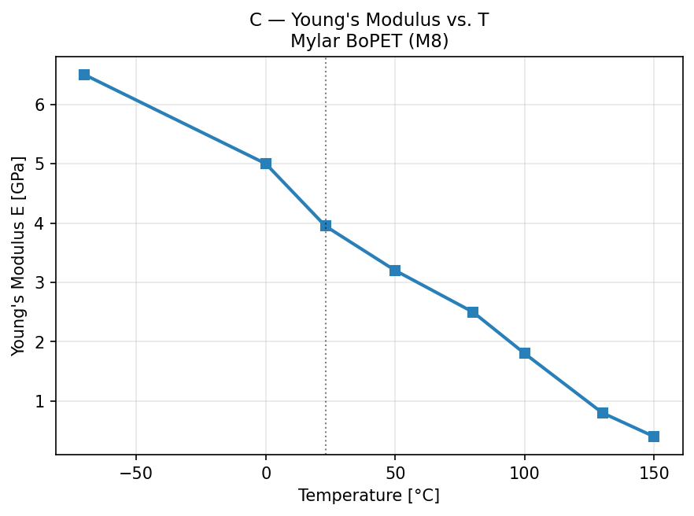

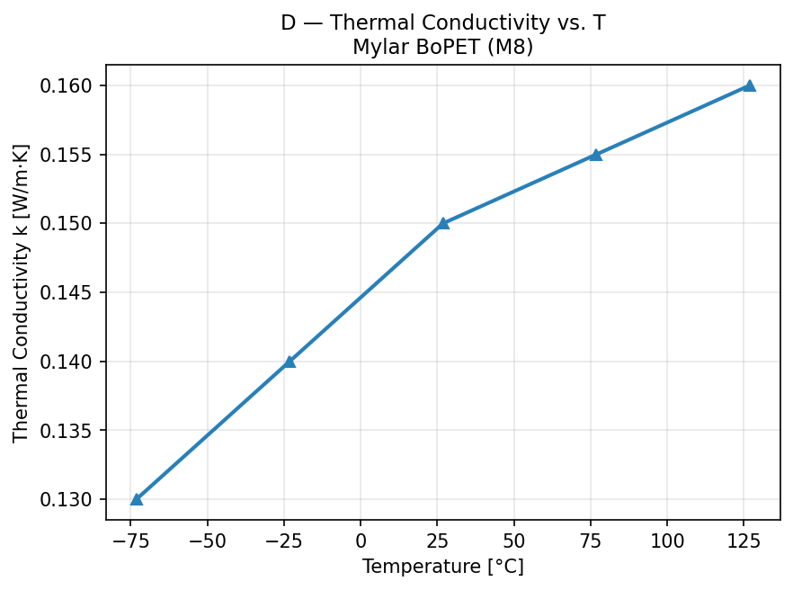

---

## 10. M9 — UHMWPE (Polietylen o ultra-wysokiej masie cząsteczkowej)

### Charakterystyka

UHMWPE (Ultra-High Molecular Weight Polyethylene) — masa cząsteczkowa 3,5–7,5 × 10⁶ g/mol. Najlżejszy spośród 13 materiałów (940 kg/m³). Doskonała odporność na ścieranie i udar. Przy pokojowej temperaturze balistyczne parametry ochrony przewyższają Kevlar. **Kluczowe ograniczenie:** temperatura topnienia ~135 °C — już przy 80 °C traci ~75% wytrzymałości. Podatny na AO i promieniowanie UV (łańcuchy PE nie zawierają grup aromatycznych).

### Właściwości mechaniczne (T = 23 °C)

| Właściwość | Wartość | Jednostka |
|---|---|---|
| UTS | **200** ±50 | MPa |
| Moduł Younga E | **0,9** ±0,1 | GPa |
| Granica plastyczności σ_y | **25** ±3 | MPa |
| Wydłużenie przy zerwaniu | **350** ±50 | % |
| Odporność na pękanie K_IC | ~2,0 | MPa·m^0.5 |
| Gęstość | **940** | kg/m³ |

### Właściwości termiczne

| Właściwość | Wartość | Jednostka |
|---|---|---|
| Przewodnictwo cieplne k | **0,44** | W/m·K |
| Pojemność cieplna Cp | **1 850** | J/kg·K |
| Zakres temperatur | **−150 … +80** | °C |

### Wykresy

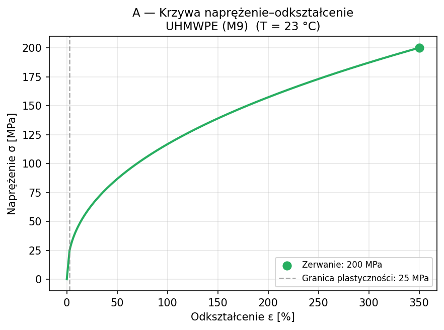

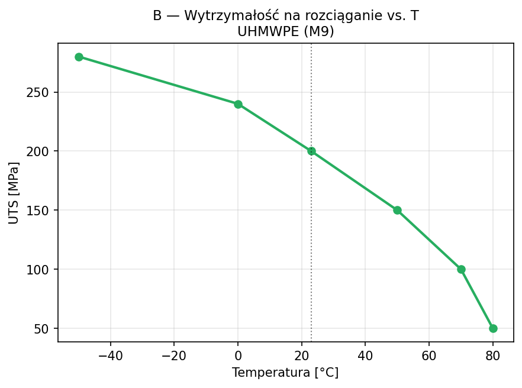

*Dramatyczny spadek UTS po 23 °C — materiał bardzo wrażliwy termicznie.*

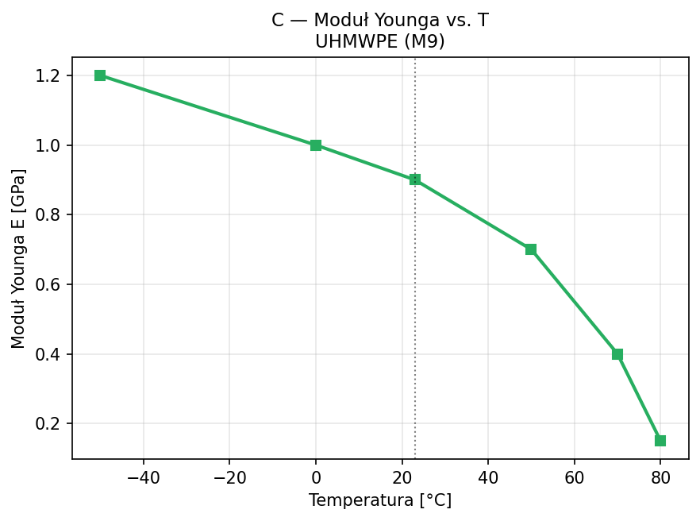

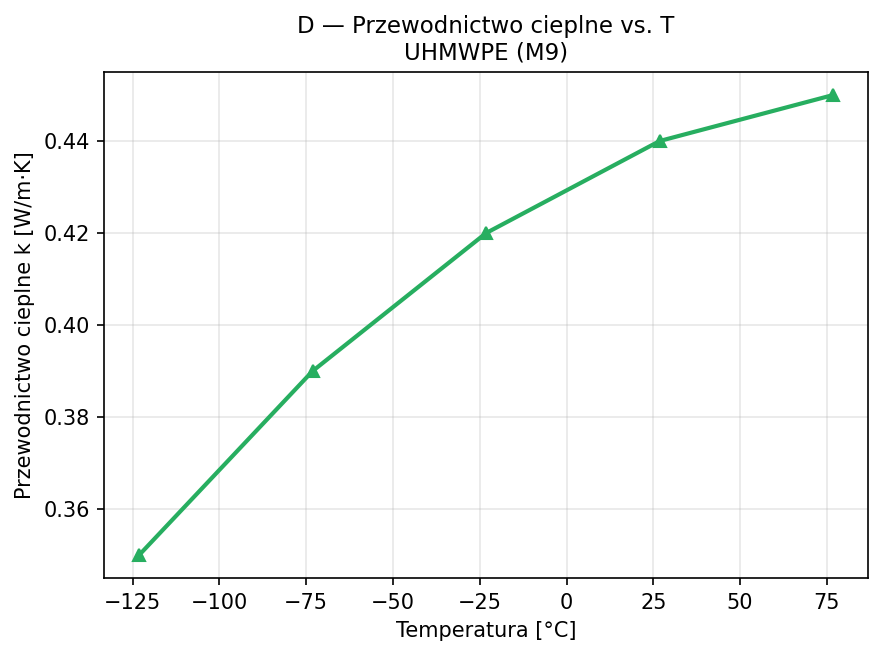

---

## 11. M10 — Kompozyt PE (Włókno UHMWPE / osnowa polimerowa)

### Charakterystyka

Laminaty z włókien UHMWPE (Dyneema SK75/SK76, Spectra 1000) zalane żywicą epoksydową lub HDPE. Drastycznie wyższe właściwości mechaniczne niż lity UHMWPE dzięki efektowi zbrojenia. Najniższa gęstość wśród kompozytów (≈1000 kg/m³) — idealne do lekkich osłon balistycznych i MMOD w zimnej części orbity. Temperatura pracy ograniczona osnową do ~120 °C.

### Właściwości mechaniczne (T = 23 °C)

| Właściwość | Wartość | Jednostka |
|---|---|---|
| UTS | **400** ±50 | MPa |
| Moduł Younga E | **30** ±5 | GPa |
| Wydłużenie przy zerwaniu | **1,5** | % |
| Gęstość | **1 000** | kg/m³ |

### Właściwości termiczne

| Właściwość | Wartość | Jednostka |
|---|---|---|
| Przewodnictwo cieplne k | **0,35** | W/m·K |
| Zakres temperatur | **−150 … +120** | °C |

### Wykresy

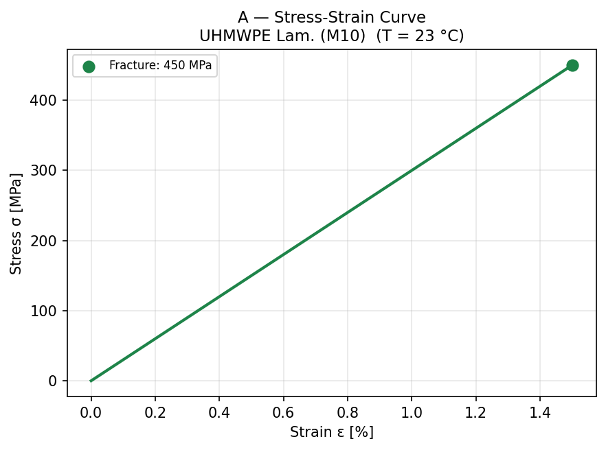

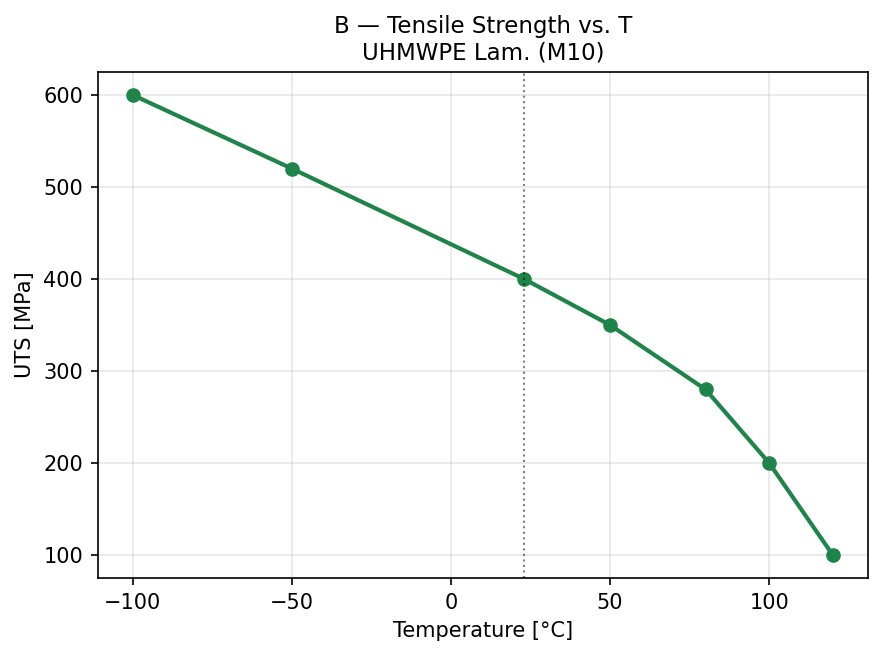

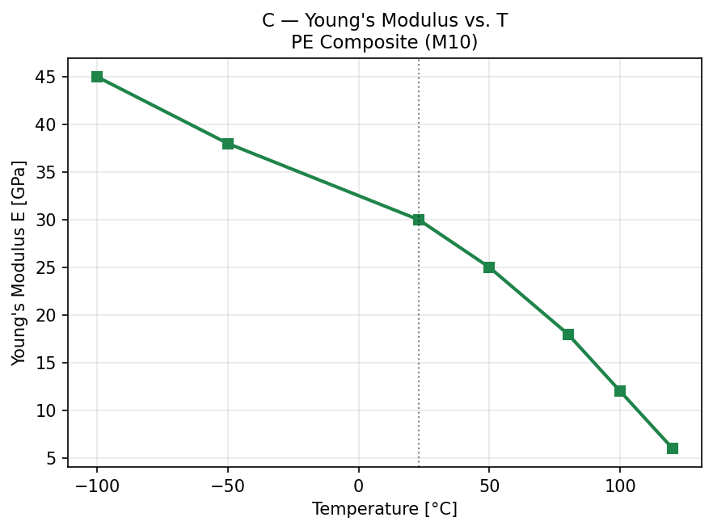

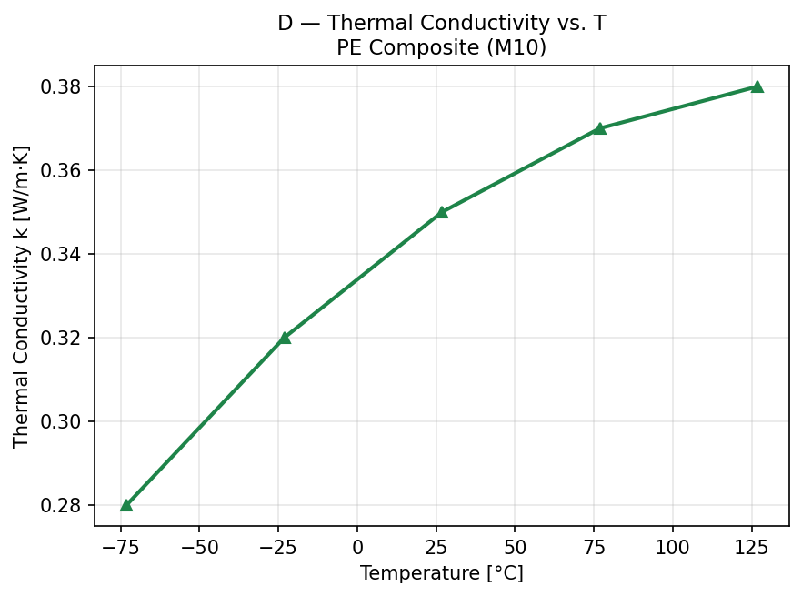

---

## 12. M11 — Kompozyt Kevlar (Kevlar / epoksyd)

### Charakterystyka

Laminat z tkaniny Kevlar-29/49 infuzowanej żywicą epoksydową (np. Hexcel 8552). Powszechnie stosowany w strukturze statków kosmicznych i rakiet nośnych (osłony, ścianki działowe, panele). Zachowuje wysoką wytrzymałość przy niskich temperaturach; górna granica wyznaczona jest przez osnowę epoksydową (~180 °C). Odporność na MMOD dzięki zdolności Kevlaru do pochłaniania energii uderzenia (deformacja włókien).

### Właściwości mechaniczne (T = 23 °C)

| Właściwość | Wartość | Jednostka |
|---|---|---|
| UTS | **600** ±80 | MPa |
| Moduł Younga E | **40** ±5 | GPa |
| Wydłużenie przy zerwaniu | **1,8** | % |
| Gęstość | **1 380** | kg/m³ |

### Właściwości termiczne

| Właściwość | Wartość | Jednostka |
|---|---|---|
| Przewodnictwo cieplne k | **0,12** | W/m·K |
| Pojemność cieplna Cp | **1 300** | J/kg·K |
| Zakres temperatur | **−55 … +180** | °C |

### Wykresy

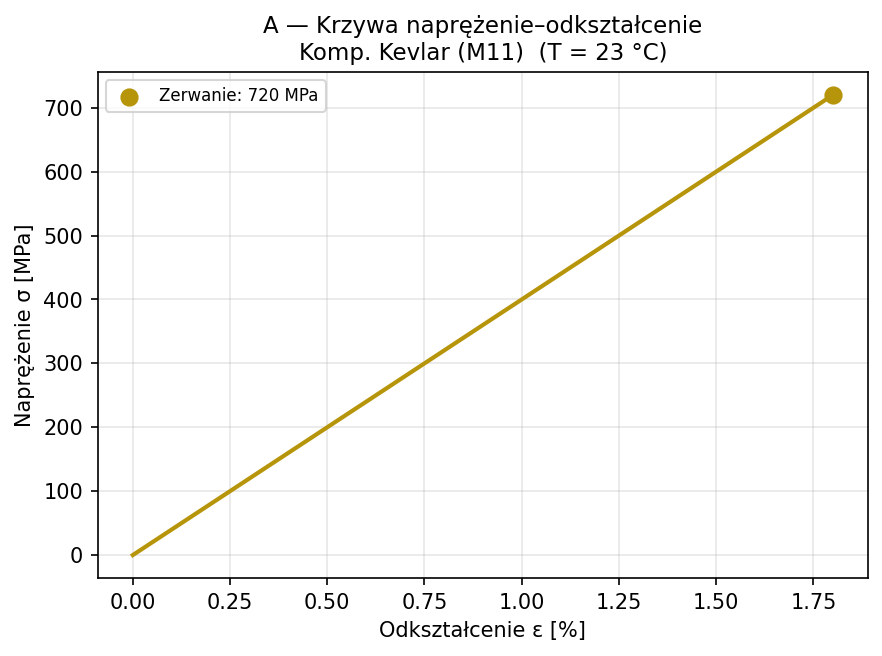

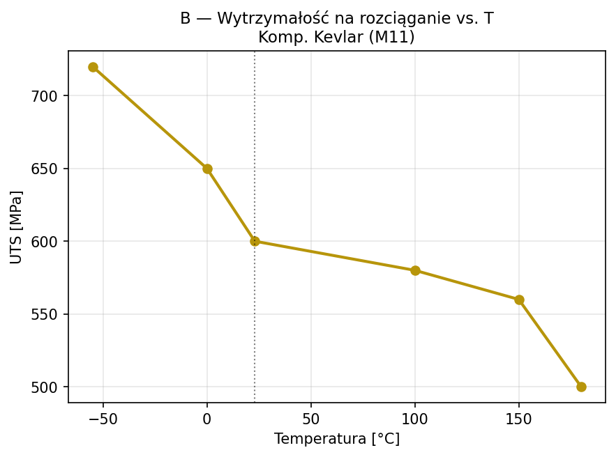

*Dobra stabilność UTS od −55 do +180 °C — Kevlar stabilizuje osnowę epoksydową.*

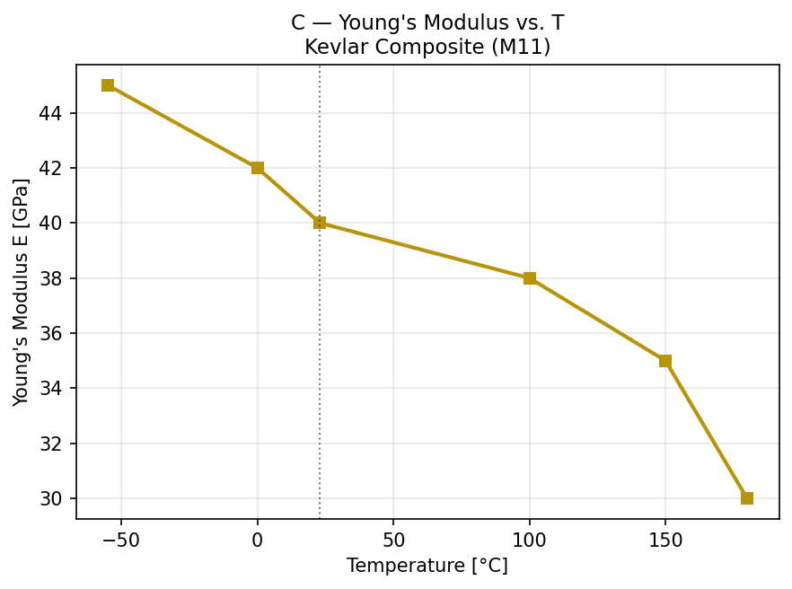

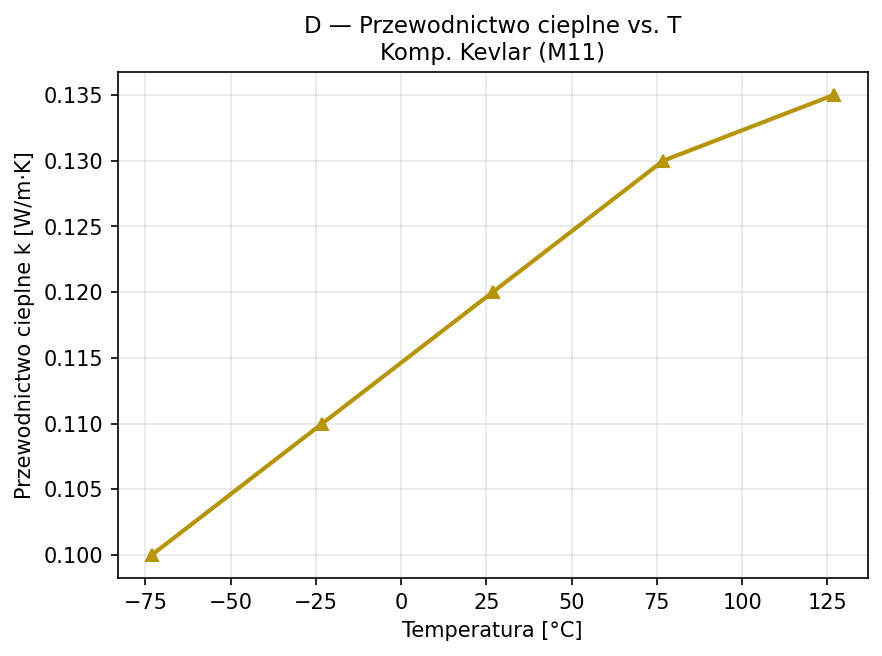

---

## 13. M12 — Kompozyt fenolowy (Węgiel / Żywica fenolowa)

### Charakterystyka

Węglowo-fenolowe (C/C-Ph) kompozyty to **złoty standard ablacyjnego TPS** dla rakiet i misji powrotnych. Stosowane w dyszach SRB (Space Shuttle), ablatorach PICA (Stardust, MSL Curiosity), osłonach cieplnych pojazdów powrotnych. Pyroliza fenolowej osnowy (~300–600 °C) tworzy warstwę zwęgloną, która sublimuje usuwając ciepło — strumienie cieplne do 20 MW/m² wytrzymywane przez sekundy. Najwyższa K_IC spośród wszystkich 13 materiałów dzięki zbrojeniu węglowemu (15 MPa·m^0.5).

### Właściwości mechaniczne (T = 23 °C)

| Właściwość | Wartość | Jednostka |
|---|---|---|
| UTS | **350** ±50 | MPa |
| Moduł Younga E | **35** ±5 | GPa |
| Wydłużenie przy zerwaniu | **0,8** | % |
| Odporność na pękanie K_IC | **15** ±3 | MPa·m^0.5 |
| Gęstość | **1 550** | kg/m³ |
| Uzysk węglowy (TGA 1000 °C) | **~70** | % |

### Właściwości termiczne

| Właściwość | Wartość | Jednostka |
|---|---|---|
| Przewodnictwo cieplne k | **2,0** | W/m·K |
| Pojemność cieplna Cp | **1 400** | J/kg·K |
| Zakres temperatur | **−55 … >2000** | °C (ablacyjny) |

### Wykresy

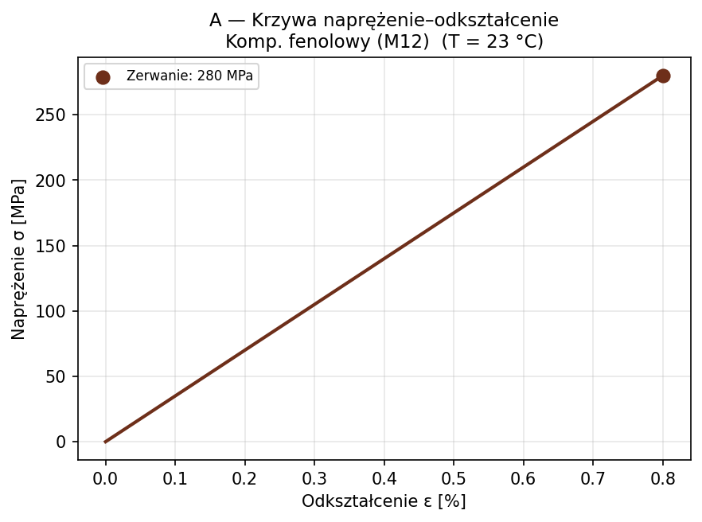

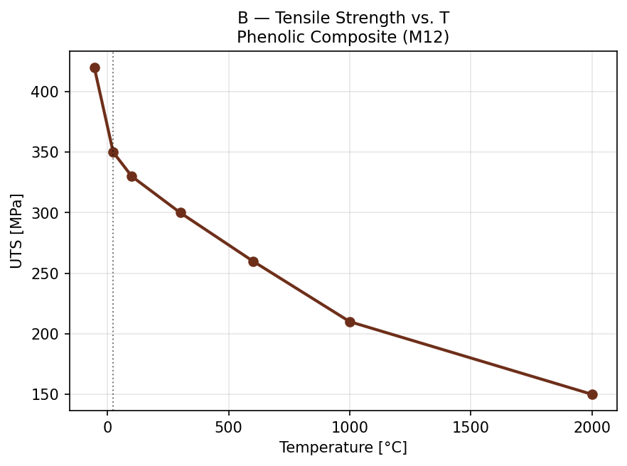

*Doskonałe zachowanie UTS w całym zakresie termicznym — laminat węglowy stabilizuje strukturę nawet przy 2000 °C.*

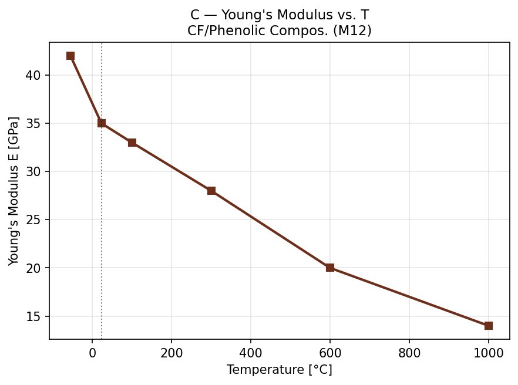

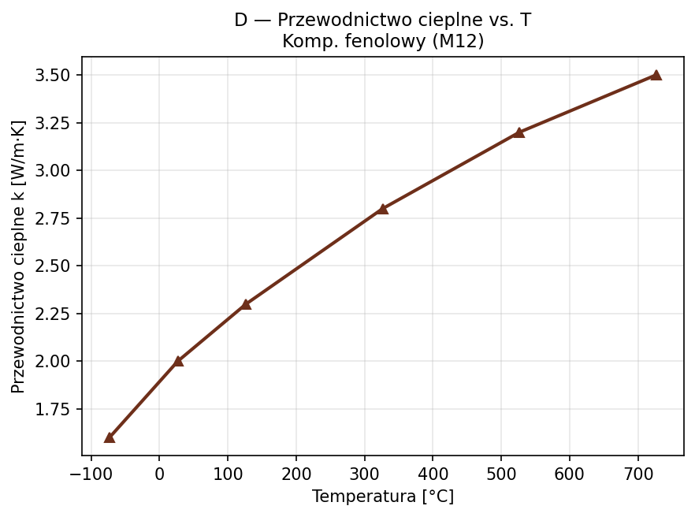

*k = 2 W/m·K — najwyższe z 13 materiałów; ważne dla odprowadzania ciepła z ablacyjnego czołowego.*

---

## 14. M13 — Kompozyt polisiloksanowy II (Klasa ogólna)

### Charakterystyka

Szersza rodzina kompozytów na osnowie polisiloksanowej, obejmująca warianty zbrojone włóknem węglowym, szklanym lub krzemionkowym — analogiczne do M6 lecz produkowane przez różnych wytwórców lub przy innym stosunku wzmocnienia. Łączą właściwości ablacyjne M6 z możliwością większej swobody projektowania geometrii 3D. Uzysk węglowy ~80%, zakres T do 1200 °C.

### Właściwości mechaniczne (T = 23 °C)

| Właściwość | Wartość | Jednostka |
|---|---|---|
| UTS | **150** ±30 | MPa |
| Moduł Younga E | **25** ±5 | GPa |
| Wydłużenie przy zerwaniu | **0,7** | % |
| Odporność na pękanie K_IC | ~2,0 | MPa·m^0.5 |
| Gęstość | **1 450** | kg/m³ |
| Uzysk węglowy | **~80** | % |

### Właściwości termiczne

| Właściwość | Wartość | Jednostka |
|---|---|---|
| Przewodnictwo cieplne k | **0,50** | W/m·K |
| Pojemność cieplna Cp | **1 300** | J/kg·K |
| Zakres temperatur | **−60 … +1200** | °C |

### Wykresy

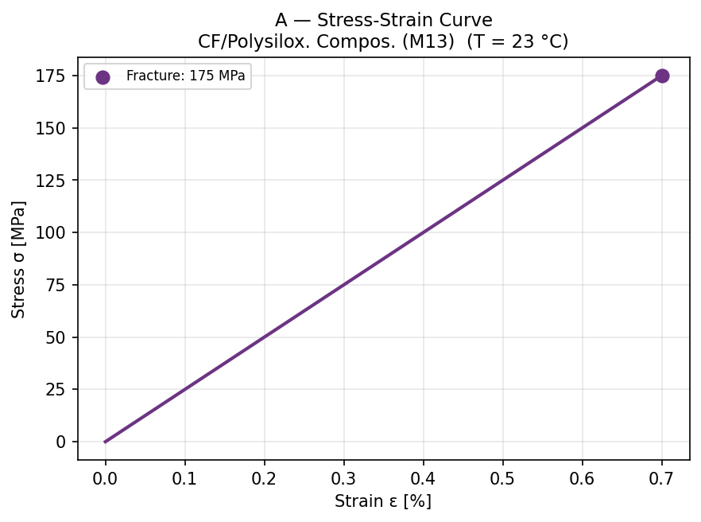

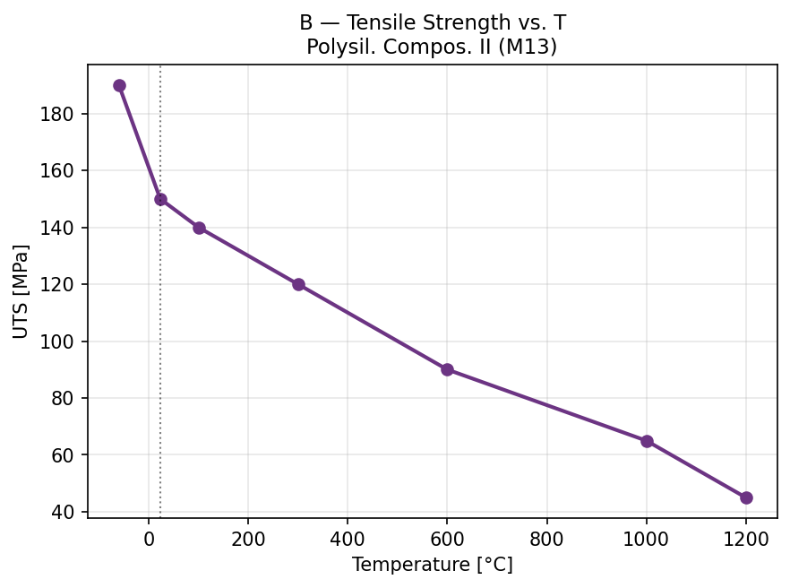

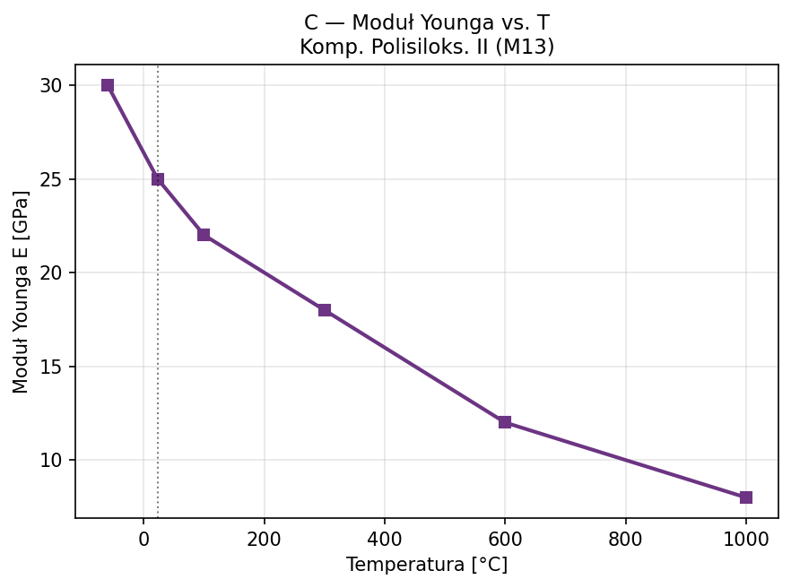

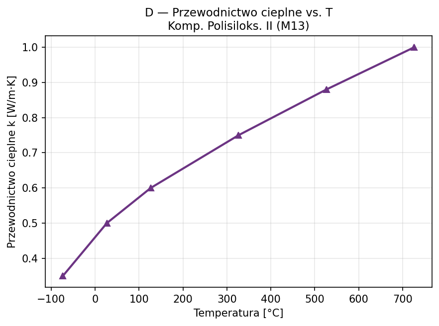

---

## 15. Zestawienie porównawcze wszystkich materiałów

### 15.1 Zestawienie tabelaryczne (RT = 23 °C)

| # | Materiał | UTS [MPa] | E [GPa] | ρ [kg/m³] | T_min [°C] | T_max [°C] | k [W/m·K] | K_IC [MPa·m^0.5] |
|---|---|---|---|---|---|---|---|---|
| M1 | Kapton | 231 | 2,5 | 1 420 | −269 | 400 | 0,12 | 3,5 |
| M2 | POSS-PI | 210 | 2,3 | 1 450 | −269 | 450 | 0,15 | 2,0 |
| M3 | Fen. żywica | 45 | 3,5 | 1 250 | −55 | 2 000* | 0,30 | 0,7 |
| M4 | Ftalonitryl | 65 | 4,0 | 1 250 | −55 | 375 | 0,20 | 1,0 |
| M5 | RTV Silikon | 6 | 0,003 | 1 175 | −115 | 300 | 0,25 | — |
| M6 | Komp. Polisil. | 182 | 45,5 | 1 320 | −60 | 1 400* | 0,21 | 2,52 |
| M7a | Kevlar-29 | 3 600 | 70,5 | 1 440 | −196 | 430 | 0,04 | — |
| M7b | Kevlar-49 | 3 800 | 125 | 1 440 | −196 | 430 | 0,04 | — |
| M8 | Mylar BoPET | 200 | 3,95 | 1 395 | −70 | 150 | 0,15 | 3,5 |
| M9 | UHMWPE | 200 | 0,9 | 940 | −150 | 80 | 0,44 | 2,0 |
| M10 | Komp. PE | 400 | 30 | 1 000 | −150 | 120 | 0,35 | — |
| M11 | Komp. Kevlar | 600 | 40 | 1 380 | −55 | 180 | 0,12 | — |
| M12 | Komp. fen. | 350 | 35 | 1 550 | −55 | 2 000* | 2,00 | 15 |
| M13 | Komp. Polisil. II | 150 | 25 | 1 450 | −60 | 1 200* | 0,50 | 2,0 |

*\* T_max dla materiałów ablacyjnych oznacza skuteczną ochronę ablacyjną, nie ciągłą pracę strukturalną.*

### 15.2 Wykresy porównawcze

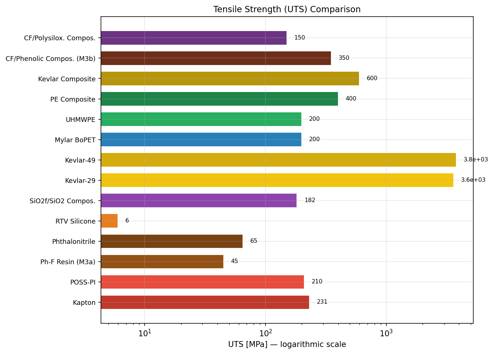

*Kevlar-49 i Kevlar-29 dominują o rząd wielkości nad pozostałymi.*

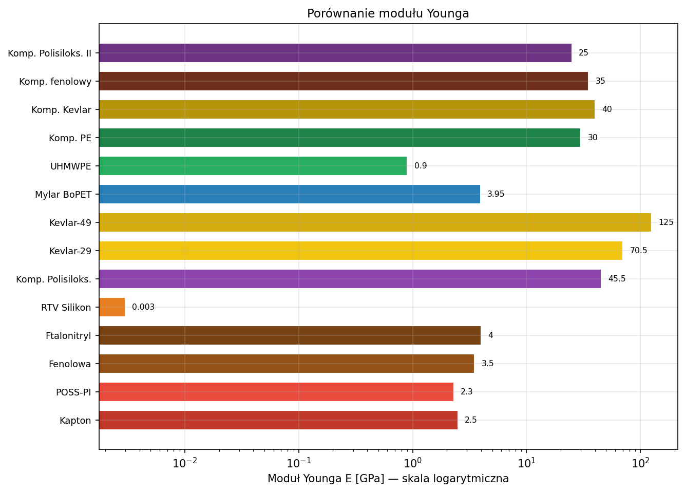

*Kevlar-49 (125 GPa) — najsztywniejszy. M5 RTV (3 MPa) — najmiększy.*

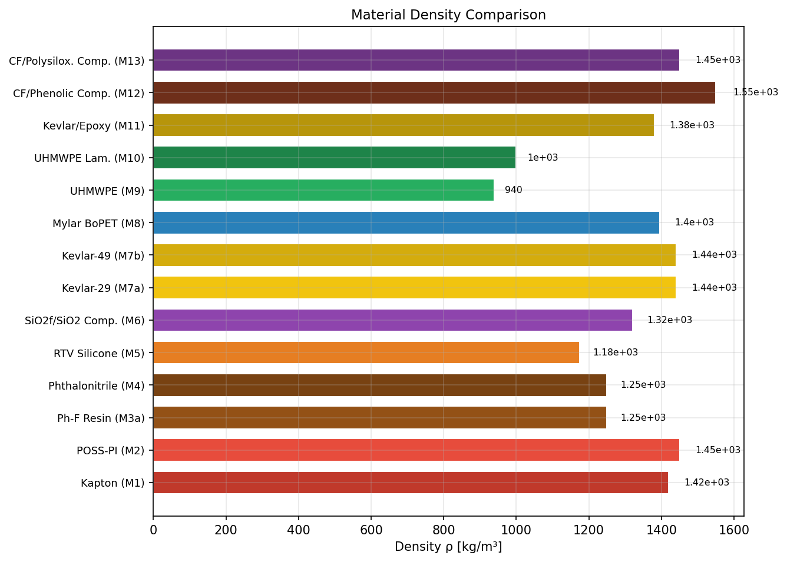

*UHMWPE (940 kg/m³) jest jedynym materiałem lżejszym od wody.*

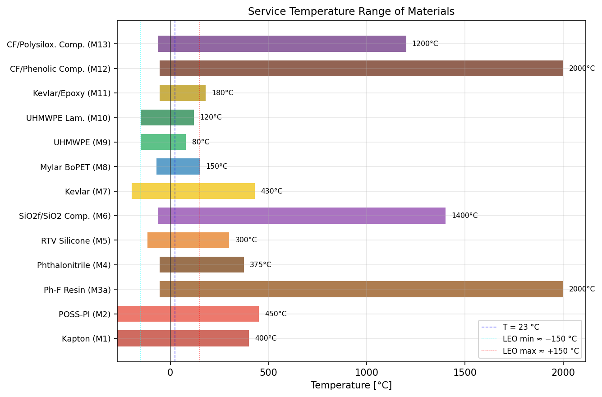

*Materiały ablacyjne (M3, M6, M12, M13) pokrywają największy zakres. Krytyczny próg LEO (−150…+150 °C) zaznaczono punktowanymi liniami.*

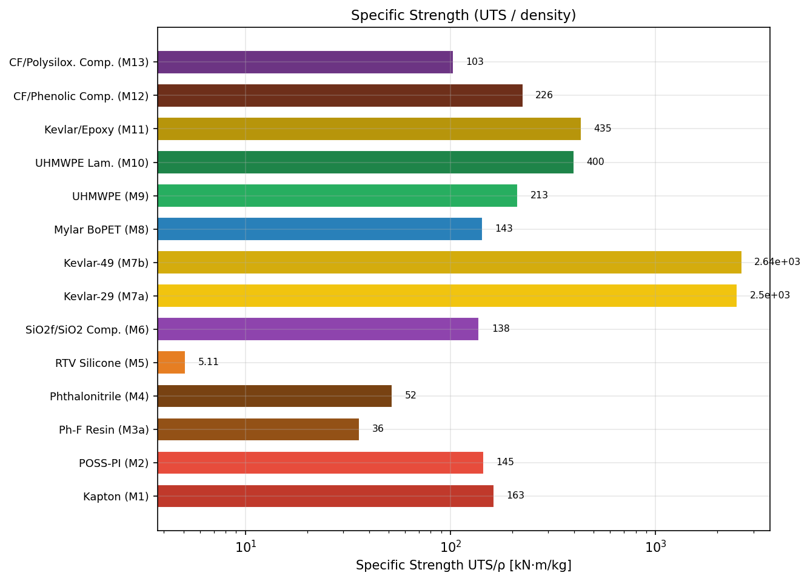

*Kevlar zdecydowanie dominuje — wytrzymałość właściwa 2,5 km²/s² ≈ 5× wyżej niż kolejny materiał.*

---

## 16. Rekomendacja — Top 5 najlepszych materiałów ochronnych

### Metodologia oceny

Oceniono każdy materiał w pięciu kategoriach na potrzeby ochrony pojazdu kosmicznego (**faza startu + orbita LEO**):

| Kryterium | Waga | Uzasadnienie |
|---|---|---|
| Wytrzymałość właściwa (UTS/ρ) | 25% | Minimalizacja masy przy danej nośności |
| Zakres temperatur (T_max − T_min) | 20% | Pokrycie obu faz misji |
| Odporność na AO i UV | 20% | Degradacja powierzchniowa na LEO |
| Zdolność absorpcji ciepła (TPS/ablacja) | 20% | Start i ewentualny powrót |
| Odporność na pękanie K_IC / udarność | 15% | MMOD, drgania startowe |

### Wynik — Top-5

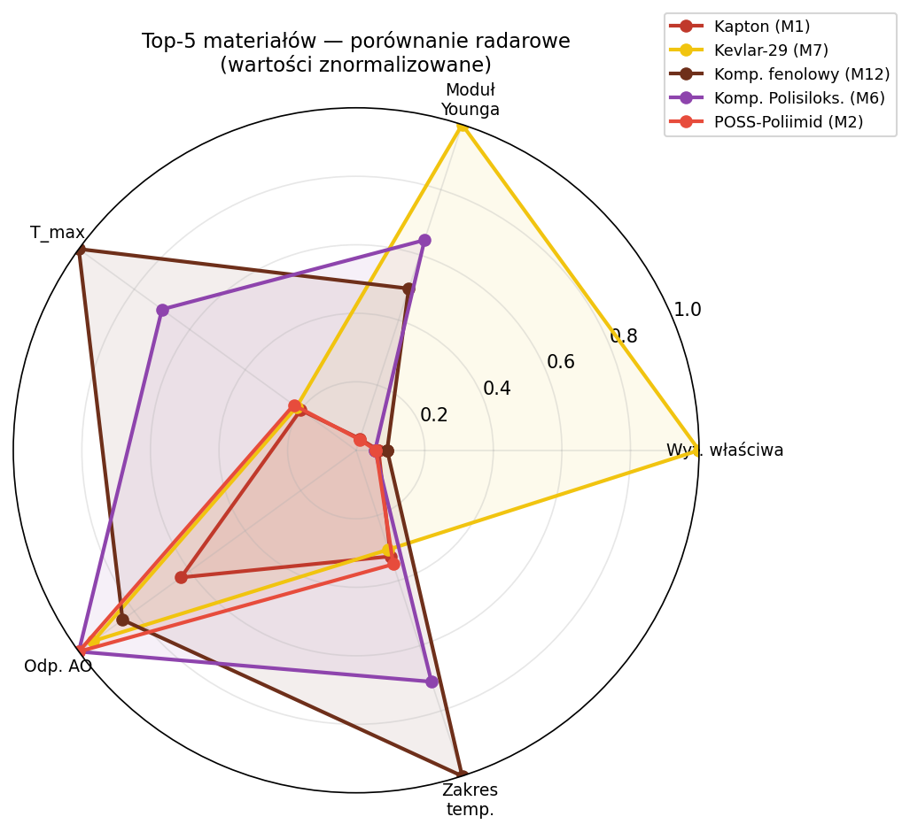

---

### 🥇 1. Kapton / Poliimid HN (M1)

**Zastosowania:** folie MLI, substrat PCB, ekrany termiczne, przewody elastyczne, folioprzesłony

**Dlaczego najlepszy:**
- **Heritage kosmiczny 60+ lat** — jedyny materiał użyty na każdej misji od Apollo po JWST. Perfekcyjnie zbadany w środowisku kosmicznym
- **Zakres temperatur −269…+400 °C** pokrywa zarówno kriogeniczne podłoże zbiornika paliwa jak i nagrzewanie aerodynamiczne
- **Zero pełzania** i zero outgassingu w próżni — nie zanieczyszcza optyki i czujników
- **Odporność na promieniowanie** (γ, elektrony, protony) — certyfikowany do 10⁸ rad
- **Ograniczenie:** erozja AO ~3×10⁻²⁴ cm³/atom — wymaga powłoki Al lub SiO₂ na stronach eksponowanych

---

### 🥈 2. Kevlar-29 / Kevlar-49 (M7)

**Zastosowania:** zbiorniki ciśnieniowe, tarcze Whipple'a, struktury nośne, preformy TPS

**Dlaczego drugie:**
- **Najwyższa wytrzymałość właściwa** ze wszystkich 13 materiałów: UTS/ρ = 2 500 kN·m/kg — 2,5× więcej niż kompozyt fenolowy
- **Stabilność termiczna −196…+430 °C** — zachowuje >75% UTS w całym tym zakresie, od kriogenicznego paliwa rakietowego po strumień plazmowy
- **Ochrona MMOD (Whipple shield):** tkanina Kevlaru jako tylna przeszkoda absorbuje resztki uderzenia, ograniczając penetrację przez kolejne ściany
- **Zbiorniki ciśnieniowe:** standardowe zbiorniki helowe i N₂ w satelitach to laminaty K-49 — niezbędne dla układów propulsyjnych
- **Ograniczenie:** brak yield — nagłe kruche pęknięcie włókna; w kompozytach wymaga odpowiedniej osnowy

---

### 🥉 3. Kompozyt polisiloksanowy (M6)

**Zastosowania:** ablacyjny TPS stopni rakietowych, izolacja cieplna dyszy, pokrycia wejścia w atmosferę

**Dlaczego trzecie:**
- **Zakres T −60…+1400 °C** — najszerszy po materiałach węglowo-fenolowych; unikalny dla organiku
- **Uzysk węglowy 86,5%** — po pirolizie zachowuje integralność strukturalną jako ceramika SiOC; praktycznie nie ulega erozji
- **Odporność na AO** lepsza niż Kapton — pasywacja przez SiO₂ jest trwalsza niż u poliimidów
- **Przyzwoite właściwości mechaniczne** (UTS = 182 MPa, E = 45,5 GPa) umożliwiają zastosowania strukturalno-ablacyjne bez oddzielnego nośnika
- **Ograniczenie:** kruchy (wydłużenie 0,97%), podatny na udary balistyczne przy niskich T

---

### 4. Kompozyt węglowo-fenolowy (M12)

**Zastosowania:** dysze SRB, TPS wejścia w atmosferę, pokrycia silnikowe

**Dlaczego czwarte:**
- **Najwyższe K_IC = 15 MPa·m^0.5** (o rząd wyższe niż poliimidy) — jedyny materiał z listy, który jest jednocześnie twardym ablacyjnym i odpornym na propagację pęknięć
- **Ablacja do >2000 °C** — niezbędne dla komory spalania i dyszy, gdzie żaden inny organik nie przeżyje
- **Uzysk węglowy 70%** i k = 2 W/m·K umożliwiają aktywne odprowadzanie ciepła przez warstwę zwęgloną
- **Dobra wytrzymałość mechaniczna** (350 MPa) i wysoki moduł (35 GPa) — nadaje się do elementów strukturalnych nośnego stożka
- **Ograniczenie:** najwyższa gęstość (1550 kg/m³), podatność na absorpcję wilgoci przed startem

---

### 5. POSS-Poliimid (M2)

**Zastosowania:** zewnętrzne folie MLI dla długoterminowych misji LEO, powłoki antystatyczne

**Dlaczego piąte:**
- **Lepsza odporność na AO** niż Kapton przy zachowaniu wszystkich jego zalet — nanocząstki POSS tworzą ciągłą powłokę SiO₂ in situ, która samoregeneruje się nawet po mikroerozji
- **T_max = 450 °C** (+50 °C vs. Kapton) przy analogicznych właściwościach mechanicznych
- **Kluczowe dla 10+ lat misji LEO** (ISS-typ, konstelacje satelitów) — tlenowanie AO na orbicie 400 km jest ~10× agresywniejsze niż na 600 km
- **Niskie outgassing** — potwierdzono certyfikację ASTM E595 (TML < 1%)
- **Ograniczenie:** wyższy koszt produkcji niż Kapton HN; mniejsza dostępność handlowa

---

### Podsumowanie rekomendacji

| Ranga | Materiał | Główna rola | Kluczowa przewaga |
|---|---|---|---|
| 🥇 | **Kapton (M1)** | Folie termiczne, substrat | Heritage, zakres T, promieniowanie |
| 🥈 | **Kevlar-29/49 (M7)** | Struktura, zbiorniki, MMOD | Wytrzymałość właściwa 2,5 km²/s² |
| 🥉 | **Komp. Polisiloks. (M6)** | TPS ablacyjny, izolacja | T_max 1400 °C, uzysk 86,5% |
| 4 | **Komp. fenolowy (M12)** | Dysze, TPS wejścia | K_IC 15 MPa·m^0.5, T > 2000 °C |
| 5 | **POSS-Poliimid (M2)** | Folie na LEO długoterm. | Odporność AO, T_max +50 °C vs. M1 |

> **Ważna uwaga:** żaden pojedynczy materiał nie jest optymalny dla wszystkich komponentów pojazdu kosmicznego. Realistyczna architektura łączy co najmniej 3–4 z powyższych: Kapton na zewnętrznych foliach MLI, Kevlar w zbiornikach i tarczach MMOD, kompozyt fenolowy lub polisiloksanowy w komorze silnika / dyszy, POSS-PI jako substrat na stronach eksponowanych na AO przy długich misjach LEO.

---

## 17. Wnioski

1. **M9 (UHMWPE) i M10 (Komp. PE)** są wykluczone z zastosowań bliskich źródłom ciepła (T_max ≤ 120 °C) — nadają się wyłącznie do zimnych komponentów strukturalnych i osłon MMOD na zacienionych orbitach.

2. **M8 (Mylar BoPET)** i **M11 (Komp. Kevlar)** pełnią wartościową rolę pomocniczą — Mylar jako reflektor w MLI, Kevlar-kompozyt jako laminat w strukturze — jednak ograniczone temperatury pracy (150 i 180 °C odpowiednio) wykluczają je z TPS.

3. **M5 (RTV Silikon)** pozostaje niezastąpiony jako uszczelnienie i klej — żaden inny materiał z listy nie zapewni takiego zakresu temperatury przy wydłużeniu 400%.

4. **M4 (Ftalonitryl)** wyróżnia się wyjątkowo stałym UTS do 375 °C przy zerowym outgassingu — obiecujący dla elementów wysokotemperaturowych w układzie napędowym, ale brak T_max > 500 °C ogranicza użycie w TPS.

5. **Hierarchia dla ochrony przed startem i LEO:** M12 > M6 (ablacja) → M7 (struktura/MMOD) → M1/M2 (folie/substrat) → M5 (uszczelnienia).

---

*Wykresy wygenerowano skryptem `plots/generate_plots_all.py`. Dane dla M5–M8 pochodzą z recenzowanych artykułów naukowych (szczegółowe źródła w raporcie Filipa `../Filip/raport_filip.md`). Dane dla M1–M4 i M9–M13 oparte na danych katalogowych producentów i literaturze (DuPont, MatWeb, PMC, Google Doc „Kapton sekcja").*
