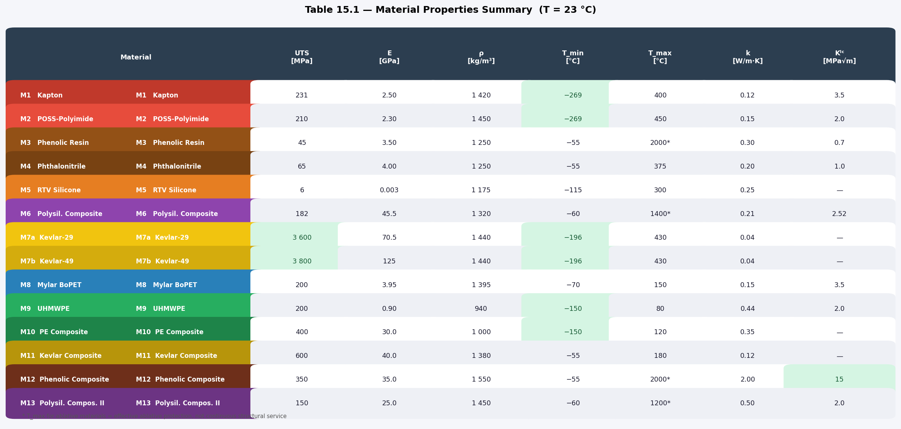

# Raport zbiorczy — Właściwości materiałów organicznych dla pojazdów kosmicznych
## *A comparison of selected organic materials for low orbiting spacecraft*

**Data:** 2026-05-05  
**Materiały:** M1–M13 (przydziały: Magda M1–M4 · Filip M5–M8 · Kalina M9–M13)

---

## 1. Wstęp

Niniejszy raport zestawia właściwości mechaniczne i termiczne trzynastu organicznych materiałów rozpatrywanych w kontekście zastosowań na pojazdach kosmicznych operujących w fazie startu oraz na niskiej orbicie okołoziemskiej (LEO, 160–2000 km). W końcowej sekcji dokonano wyboru **pięciu najlepszych materiałów** z uzasadnieniem opartym na wymaganiach środowiskowych LEO i fazy startowej.

### Wymagania środowiskowe

| Faza | Główne zagrożenia | Kluczowe wymagania |
|---|---|---|
| **Start** | Strumień cieplny 1–10 MW/m², drgania, przeciążenia 5–12 g | Ablacja / TPS, wytrzymałość mechaniczna, mała masa |
| **LEO (orbit.)** | Tlenkowanie atomowe (AO), UV, cykle termiczne −150…+150 °C, MMOD | Odporność na AO/UV, stabilność wymiarowa, wysoka K_IC |

Struktura raportu: każdy materiał opisany jest tabelą właściwości i czterema wykresami:

| Wykres | Treść |
|---|---|
| **A** | Krzywa naprężenie–odkształcenie (23 °C) |
| **B** | UTS vs. temperatura |
| **C** | Moduł Younga vs. temperatura |
| **D** | Przewodnictwo cieplne vs. temperatura |

---

## 2. M1 — Kapton (Poliimid HN, DuPont)

### Charakterystyka

Kapton HN (poli(4,4'-oksydifenylen)-piromellitimid) to standardowy film kosmiczny stosowany od lat 60. XX w. na praktycznie każdym statku kosmicznym — od Apollo do ISS. Wyjątkowa stabilność termiczna, zerowe pełzanie w próżni, doskonała odporność na promieniowanie jonizujące. Słaba strona: erozja atomowego tlenu (~3×10⁻²⁴ cm³/atom).

### Właściwości mechaniczne (T = 23 °C)

| Właściwość | Wartość | Jednostka | Źródło |
|---|---|---|---|
| Wytrzymałość na rozciąganie (UTS) | **231** | MPa | [DuPont Kapton HN — datasheet (PDF)](https://www.dupont.com/content/dam/dupont/amer/us/en/products/ei-transformation/documents/EI-10142_Kapton-HN-datasheet.pdf); [Google Doc — dane projektu](https://docs.google.com/document/d/1SUNR-o6LlR9Npx723FPGlJ8TDAnhCzqREIrAE7FIKa0/edit) |
| Moduł Younga (E) | **2,5** | GPa | [DuPont Kapton HN — datasheet (PDF)](https://www.dupont.com/content/dam/dupont/amer/us/en/products/ei-transformation/documents/EI-10142_Kapton-HN-datasheet.pdf) |
| Granica plastyczności σ_y | **69** | MPa | [Google Doc — dane projektu](https://docs.google.com/document/d/1SUNR-o6LlR9Npx723FPGlJ8TDAnhCzqREIrAE7FIKa0/edit) |
| Wydłużenie przy zerwaniu | **72** | % | [DuPont Kapton HN — datasheet (PDF)](https://www.dupont.com/content/dam/dupont/amer/us/en/products/ei-transformation/documents/EI-10142_Kapton-HN-datasheet.pdf) |
| Odporność na pękanie K_IC | 1,65–5,4 | MPa·m^0.5 | [Google Doc — dane projektu](https://docs.google.com/document/d/1SUNR-o6LlR9Npx723FPGlJ8TDAnhCzqREIrAE7FIKa0/edit) |
| Gęstość | **1 420** | kg/m³ | [DuPont Kapton HN — datasheet (PDF)](https://www.dupont.com/content/dam/dupont/amer/us/en/products/ei-transformation/documents/EI-10142_Kapton-HN-datasheet.pdf) |

### Właściwości termiczne

| Właściwość | Wartość | Jednostka | Źródło |
|---|---|---|---|
| Przewodnictwo cieplne k | **0,12** | W/m·K | [DuPont Kapton HN — datasheet (PDF)](https://www.dupont.com/content/dam/dupont/amer/us/en/products/ei-transformation/documents/EI-10142_Kapton-HN-datasheet.pdf); [AZoM ID:921](https://www.azom.com/article.aspx?ArticleID=921) |
| Pojemność cieplna Cp | **1 090** | J/kg·K | [DuPont Kapton HN — datasheet (PDF)](https://www.dupont.com/content/dam/dupont/amer/us/en/products/ei-transformation/documents/EI-10142_Kapton-HN-datasheet.pdf) |
| Zakres temperatur | **−269 … +400** | °C | [DuPont Kapton HN — datasheet (PDF)](https://www.dupont.com/content/dam/dupont/amer/us/en/products/ei-transformation/documents/EI-10142_Kapton-HN-datasheet.pdf); [Google Doc — dane projektu](https://docs.google.com/document/d/1SUNR-o6LlR9Npx723FPGlJ8TDAnhCzqREIrAE7FIKa0/edit) |

### Wykresy

*Semi-ductile model: linear to yield point (69 MPa), then power-law hardening to fracture at 231 MPa / 72%.*

*UTS drops from 270 MPa (−100 °C) to 40 MPa (400 °C); increases at very low T (liquid N₂). Data: project dataset.*

*E = 2.5 GPa at RT; monotonically decreases to ~0.5 GPa at 400 °C. Source: DuPont Kapton HN datasheet.*

*k increases slightly with T (0.09→0.19 W/m·K). Source: AZoM ID:921, DuPont datasheet.*

---

## 3. M2 — POSS-Poliimid (Nano-PI)

### Charakterystyka

Poliimid modyfikowany nanocząstkami POSS (polyhedral oligomeric silsesquioxane). Nanocząstki SiO₂ wbudowane w łańcuch polimerowy poprawiają odporność na **atomowy tlen** (pasywacja SiO₂) i podwyższają temperaturę ugięcia. Właściwości mechaniczne porównywalne z Kaptonem, nieco gorsze ciągliwości. Materiał nowej generacji dla długoterminowych misji LEO.

### Właściwości mechaniczne (T = 23 °C)

| Właściwość | Wartość | Jednostka | Źródło |
|---|---|---|---|
| Wytrzymałość na rozciąganie (UTS) | **210** | MPa | [Brunsvold et al., High Perform. Polym. (2004)](https://doi.org/10.1177/0954008304024680) · [Sci-Hub](https://sci-hub.pl/10.1177/0954008304024680) |
| Moduł Younga (E) | **2,3** | GPa | [Brunsvold et al., High Perform. Polym. (2004)](https://doi.org/10.1177/0954008304024680) · [Sci-Hub](https://sci-hub.pl/10.1177/0954008304024680) |
| Granica plastyczności σ_y | **60** | MPa | [AZoM ID:921 — Poliimid (ogólny)](https://www.azom.com/article.aspx?ArticleID=921) — dane przybliżone |
| Wydłużenie przy zerwaniu | **40** | % | [Brunsvold et al., High Perform. Polym. (2004)](https://doi.org/10.1177/0954008304024680) · [Sci-Hub](https://sci-hub.pl/10.1177/0954008304024680) |
| Odporność na pękanie K_IC | ~2,0 | MPa·m^0.5 | [Gouzman et al., Acta Astronaut. (2010)](https://doi.org/10.1016/j.actaastro.2010.09.010) · [Sci-Hub](https://sci-hub.pl/10.1016/j.actaastro.2010.09.010) — szacunek |
| Gęstość | **1 450** | kg/m³ | [Brunsvold et al., High Perform. Polym. (2004)](https://doi.org/10.1177/0954008304024680) · [Sci-Hub](https://sci-hub.pl/10.1177/0954008304024680) |

### Właściwości termiczne

| Właściwość | Wartość | Jednostka | Źródło |
|---|---|---|---|
| Przewodnictwo cieplne k | **0,15** | W/m·K | [Gouzman et al., Acta Astronaut. (2010)](https://doi.org/10.1016/j.actaastro.2010.09.010) · [Sci-Hub](https://sci-hub.pl/10.1016/j.actaastro.2010.09.010) |
| Pojemność cieplna Cp | **1 050** | J/kg·K | dane katalogowe Evonik POSS — szacunek bazowany na Kaptons HN |
| Zakres temperatur | **−269 … +450** | °C | [Gouzman et al., Acta Astronaut. (2010)](https://doi.org/10.1016/j.actaastro.2010.09.010) · [Sci-Hub](https://sci-hub.pl/10.1016/j.actaastro.2010.09.010) |

### Wykresy

---

## 4. M3 — Żywica fenolowa (Phenolic Resin)

### Charakterystyka

Żywice fenolowo-formaldehydowe (np. SC-1008, Durite) to klasyczne tworzywa ablacyjne. Przy pirolizie (>300 °C) tworzą porowatą warstwę zwęgloną o wysokiej pojemności cieplnej. Stosowane w TPS (AVCOAT NASA, Phoenix lander) i dyszy silników rakietowych.

### Właściwości mechaniczne (T = 23 °C)

| Właściwość | Wartość | Jednostka | Źródło |
|---|---|---|---|
| Wytrzymałość na rozciąganie (UTS) | **45** | MPa | [AZoM ID:475 — Żywica fenolowa](https://www.azom.com/article.aspx?ArticleID=475); [MatWeb — Phenolic Resin (Cast)](https://www.matweb.com/search/QuickText.aspx?SearchText=phenolic+cast+resin) |
| Moduł Younga (E) | **3,5** | GPa | [AZoM ID:475](https://www.azom.com/article.aspx?ArticleID=475) |
| Granica plastyczności | — | kruchy materiał | — |
| Wydłużenie przy zerwaniu | **1,0** | % | [AZoM ID:475](https://www.azom.com/article.aspx?ArticleID=475) |
| Odporność na pękanie K_IC | **0,7** | MPa·m^0.5 | [AZoM ID:475](https://www.azom.com/article.aspx?ArticleID=475) |
| Gęstość | **1 250** | kg/m³ | [AZoM ID:475](https://www.azom.com/article.aspx?ArticleID=475) |
| Uzysk węglowy (TGA) | **~55** | % | [Natali et al., Compos. Part A (2012)](https://doi.org/10.1016/j.compositesa.2011.10.009) · [Sci-Hub](https://sci-hub.pl/10.1016/j.compositesa.2011.10.009) |

### Właściwości termiczne

| Właściwość | Wartość | Jednostka | Źródło |
|---|---|---|---|
| Przewodnictwo cieplne k | **0,30** | W/m·K | [AZoM ID:475](https://www.azom.com/article.aspx?ArticleID=475) |
| Pojemność cieplna Cp | **1 200** | J/kg·K | [MatWeb — Phenolic Resin](https://www.matweb.com/search/QuickText.aspx?SearchText=phenolic+cast+resin) |
| Zakres temperatur | **−55 … >2000** | °C (ablacyjny) | [Natali et al., Compos. Part A (2012)](https://doi.org/10.1016/j.compositesa.2011.10.009) · [Sci-Hub](https://sci-hub.pl/10.1016/j.compositesa.2011.10.009) |

### Wykresy

*Brittle thermoset: linear behavior up to fracture at 45 MPa / 1%. Source: AZoM ID:475.*

---

## 5. M4 — Żywica ftalonitrylowa (Phthalonitrile Resin)

### Charakterystyka

Żywice ftalonitrylowe (PT resin) to termozestawy następnej generacji z rekordową temperaturą ciągłej pracy (~370 °C) wśród polimerów organicznych. Utwardzają się bez wydzielania lotnych składników — zerowe porowatości i minimalne odgazowywanie próżniowe. Stosowane w węzłach strukturalnych statków kosmicznych i radome'ach.

### Właściwości mechaniczne (T = 23 °C)

| Właściwość | Wartość | Jednostka | Źródło |
|---|---|---|---|
| Wytrzymałość na rozciąganie (UTS) | **65** | MPa | [Hergenrother et al., Polymer (2005)](https://doi.org/10.1016/j.polymer.2005.09.039) · [Sci-Hub](https://sci-hub.pl/10.1016/j.polymer.2005.09.039) |
| Moduł Younga (E) | **4,0** | GPa | [Hergenrother et al., Polymer (2005)](https://doi.org/10.1016/j.polymer.2005.09.039) · [Sci-Hub](https://sci-hub.pl/10.1016/j.polymer.2005.09.039) |
| Granica plastyczności | — | kruchy termostat | — |
| Wydłużenie przy zerwaniu | **1,5** | % | [Laskoski et al., J. Polym. Sci. A (2006)](https://doi.org/10.1002/pola.21358) · [Sci-Hub](https://sci-hub.pl/10.1002/pola.21358) |
| Odporność na pękanie K_IC | **1,0** | MPa·m^0.5 | [Laskoski et al., J. Polym. Sci. A (2006)](https://doi.org/10.1002/pola.21358) · [Sci-Hub](https://sci-hub.pl/10.1002/pola.21358) |
| Gęstość | **1 250** | kg/m³ | [Hergenrother et al., Polymer (2005)](https://doi.org/10.1016/j.polymer.2005.09.039) · [Sci-Hub](https://sci-hub.pl/10.1016/j.polymer.2005.09.039) |
| Uzysk węglowy | **~65** | % | [Laskoski et al., J. Polym. Sci. A (2006)](https://doi.org/10.1002/pola.21358) · [Sci-Hub](https://sci-hub.pl/10.1002/pola.21358) |

### Właściwości termiczne

| Właściwość | Wartość | Jednostka | Źródło |
|---|---|---|---|
| Przewodnictwo cieplne k | **0,20** | W/m·K | [Hergenrother et al., Polymer (2005)](https://doi.org/10.1016/j.polymer.2005.09.039) · [Sci-Hub](https://sci-hub.pl/10.1016/j.polymer.2005.09.039) |
| Pojemność cieplna Cp | **1 200** | J/kg·K | szacunek na podstawie danych Hergenrother 2005 — klasa żywic PT |
| Zakres temperatur | **−55 … +375** | °C | [Hergenrother et al., Polymer (2005)](https://doi.org/10.1016/j.polymer.2005.09.039) · [Sci-Hub](https://sci-hub.pl/10.1016/j.polymer.2005.09.039) |

### Wykresy

*Exceptionally good UTS retention at high T (58 MPa at 300 °C) — superior to Kapton. Source: Hergenrother et al. 2005.*

---

## 6. M5 — Guma silikonowa / RTV

### Charakterystyka

Elastomery silikonowe (RTV — Room Temperature Vulcanizing, np. RTV566 Momentive) bazują na polidimetylosiloksanie (PDMS). Stosowane jako kleje konstrukcyjne, uszczelnienia i elementy tłumiące drgania w satelitach. Ekstremalnie elastyczne (400%), stabilne od −115 do +300 °C. Zawartość Si zapewnia częściową odporność na AO.

### Właściwości mechaniczne (T = 23 °C)

| Właściwość | Wartość | Jednostka | Źródło |
|---|---|---|---|
| Wytrzymałość na rozciąganie (UTS) | **2–10** (typowo 6) | MPa | [AZoM ID:920](https://www.azom.com/properties.aspx?ArticleID=920); [MatWeb RTV566](https://www.matweb.com/search/datasheettext.aspx?matguid=70466aea960a4c84be3bbc5045c219aa) |
| Moduł Younga (E) | **1–5** | MPa | Elastomer — 3–4 rzędy wielkości poniżej metali |
| Granica plastyczności | — | — | **Nie dotyczy** — brak dla elastomerów |
| Wydłużenie przy zerwaniu | 100–800 (typowo **400**) | % | [AZoM ID:920](https://www.azom.com/properties.aspx?ArticleID=920) |
| Odporność na pękanie K_IC | — | — | Opisywana energią rozdarcia, nie K_IC |
| Gęstość | **1 100–1 250** | kg/m³ | [AZoM ID:920](https://www.azom.com/properties.aspx?ArticleID=920); [MatWeb RTV566](https://www.matweb.com/search/datasheettext.aspx?matguid=70466aea960a4c84be3bbc5045c219aa) |

### Właściwości termiczne

| Właściwość | Wartość | Jednostka | Źródło |
|---|---|---|---|
| Przewodnictwo cieplne k | **0,25** | W/m·K | [AZoM ID:920](https://www.azom.com/properties.aspx?ArticleID=920) |
| Pojemność cieplna Cp | **1 400** | J/kg·K | [AZoM ID:920](https://www.azom.com/properties.aspx?ArticleID=920) |
| Zakres temperatur | **−115 … +300** | °C | [MatWeb RTV566](https://www.matweb.com/search/datasheettext.aspx?matguid=70466aea960a4c84be3bbc5045c219aa); [Barucci et al., Cryogenics (1998)](https://doi.org/10.1016/S0011-2275(97)00111-3) · [Sci-Hub](https://sci-hub.pl/10.1016/S0011-2275(97)00111-3) |

### Wykresy

*Neo-Hookean model (G ≈ 0.85 MPa): non-linear hyperelastic, no yield point, fracture at ~400%.*

*Log scale — E spans 3 orders of magnitude (2000→0.9 MPa). Data: [Barucci et al., Cryogenics (1998)](https://doi.org/10.1016/S0011-2275(97)00111-3) · [Sci-Hub](https://sci-hub.pl/10.1016/S0011-2275(97)00111-3)*

---

## 7. M6 — Kompozyt polisiloksanowy

### Charakterystyka

Kompozyty na osnowie polisiloksanowej (2.5D SiO₂f/SiO₂ — McDermott et al. 2022; CF/UHTR — Hou et al. Techneglas) łączą odporność na wysokie temperatury z ablacyjnością. Pyroliza daje ceramiczną matrycę SiOC zachowującą integralność do 1400 °C. Uzysk węglowy 86,5%. Odporność na AO dzięki pasywacji SiO₂.

### Właściwości mechaniczne (T = 23 °C)

| Właściwość | Wartość | Jednostka | Źródło |
|---|---|---|---|
| Wytrzymałość na rozciąganie (UTS) | **182** ±9,6 | MPa | [McDermott et al., J. Compos. Mater. (2022)](https://doi.org/10.1177/00219983211038622) · [Sci-Hub](https://sci-hub.pl/10.1177/00219983211038622) |
| Moduł Younga (E) | **45,5** ±5 | GPa | [Hou et al. — Techneglas (PDF)](https://www.techneglas.com/wp-content/uploads/2021/12/Yanan-Hou-Performance-of-a-Carbon-FiberPolysiloxane-Composite-Thermal-Ablation-Flammability-and-Mechanical-Characterization.pdf) |
| Granica plastyczności | — | — | Nie dotyczy — pęknięcie kruche |
| Wydłużenie przy zerwaniu | **0,97** | % | [Hou et al. — Techneglas (PDF)](https://www.techneglas.com/wp-content/uploads/2021/12/Yanan-Hou-Performance-of-a-Carbon-FiberPolysiloxane-Composite-Thermal-Ablation-Flammability-and-Mechanical-Characterization.pdf) |
| Odporność na pękanie K_IC | **2,52** ±0,2 | MPa·m^0.5 | [PMC11945185 (2025)](https://pmc.ncbi.nlm.nih.gov/articles/PMC11945185/) — otwarty dostęp |
| Gęstość | **1 320** | kg/m³ | [McDermott et al., J. Compos. Mater. (2022)](https://doi.org/10.1177/00219983211038622) · [Sci-Hub](https://sci-hub.pl/10.1177/00219983211038622) |
| Uzysk węglowy (1000 °C) | **86,5** | % | [Tate et al. — Techneglas (PDF)](https://www.techneglas.com) |

### Właściwości termiczne

| Właściwość | Wartość | Jednostka | Źródło |
|---|---|---|---|
| Przewodnictwo cieplne k | **0,21** ±0,03 | W/m·K | [McDermott et al., J. Compos. Mater. (2022)](https://doi.org/10.1177/00219983211038622) · [Sci-Hub](https://sci-hub.pl/10.1177/00219983211038622) |
| Pojemność cieplna Cp | **1 400** | J/kg·K | [McDermott et al., J. Compos. Mater. (2022)](https://doi.org/10.1177/00219983211038622) · [Sci-Hub](https://sci-hub.pl/10.1177/00219983211038622) |
| Zakres temperatur | **−60 … +1400** | °C | [Hou et al. — Techneglas (PDF)](https://www.techneglas.com/wp-content/uploads/2021/12/Yanan-Hou-Performance-of-a-Carbon-FiberPolysiloxane-Composite-Thermal-Ablation-Flammability-and-Mechanical-Characterization.pdf) |

### Wykresy

*Exceptional retention — UTS maintains 33% of RT value even at 1400 °C. Source: Hou et al. Techneglas.*

---

## 8. M7 — Kevlar / Włókno aramidowe (Kevlar-29 i Kevlar-49)

### Charakterystyka

Kevlar (DuPont, poli-*p*-fenylenotereftaloamid) to włókno aramidowe o najwyższej wytrzymałości właściwej spośród wszystkich 13 analizowanych materiałów. Dwa stopnie: Kevlar-29 (wyższa ciągliwość) i Kevlar-49 (wyższy moduł). Stosowany w zbiornikach ciśnieniowych, tarczach Whipple'a (MMOD), strukturach nośnych.

### Właściwości mechaniczne (T = 23 °C)

| Właściwość | Kevlar-29 | Kevlar-49 | Jednostka | Źródło |
|---|---|---|---|---|
| Wytrzymałość na rozciąganie (UTS) | **3 600** ±200 | **3 800** ±200 | MPa | [DuPont Kevlar Technical Guide (PDF)](https://www.dupont.com/content/dam/dupont/amer/us/en/products/ei-transformation/documents/Kevlar_Technical_Guide.pdf); [MatWeb Kevlar 29](https://www.matweb.com/search/datasheettext.aspx?matguid=7f0915e45f3b490db5e5e88c75d2e8b0) |
| Moduł Younga (E) | **70,5** ±2 | **125** ±5 | GPa | [DuPont Kevlar Technical Guide (PDF)](https://www.dupont.com/content/dam/dupont/amer/us/en/products/ei-transformation/documents/Kevlar_Technical_Guide.pdf) |
| Wydłużenie przy zerwaniu | **3,6** ±0,2 | **2,4** ±0,2 | % | [DuPont Kevlar Technical Guide (PDF)](https://www.dupont.com/content/dam/dupont/amer/us/en/products/ei-transformation/documents/Kevlar_Technical_Guide.pdf) |
| Odporność na pękanie K_IC | — | — | — | Nie definiowana dla włókna |
| Gęstość | **1 440** | **1 440** | kg/m³ | [DuPont Kevlar Technical Guide (PDF)](https://www.dupont.com/content/dam/dupont/amer/us/en/products/ei-transformation/documents/Kevlar_Technical_Guide.pdf) |

### Właściwości termiczne

| Właściwość | Wartość | Jednostka | Źródło |
|---|---|---|---|
| Przewodnictwo cieplne k (poprzeczne) | **0,04** | W/m·K | [Ventura & Martelli, Cryogenics (2009)](https://doi.org/10.1016/j.cryogenics.2009.04.001) · [Sci-Hub](https://sci-hub.pl/10.1016/j.cryogenics.2009.04.001) |
| Pojemność cieplna Cp | **1 420** | J/kg·K | [PMC12349578 (2025)](https://pmc.ncbi.nlm.nih.gov/articles/PMC12349578/) — otwarty dostęp |
| Zakres temperatur | **−196 … +430** | °C | [DuPont Kevlar Technical Guide (PDF)](https://www.dupont.com/content/dam/dupont/amer/us/en/products/ei-transformation/documents/Kevlar_Technical_Guide.pdf) |

### Wykresy

*K-29: higher elongation (3.6%), K-49: higher modulus (125 GPa) with slightly higher UTS. Source: DuPont Technical Guide.*

*Exceptional stability — UTS retains >75% from −196 to +430 °C. Source: DuPont Technical Guide; PMC12349578.*

*Dane kriogeniczne z [Ventura & Martelli, Cryogenics (2009)](https://doi.org/10.1016/j.cryogenics.2009.04.001) — k → 0,007 W/m·K przy 7 K.*

---

## 9. M8 — Mylar / BoPET (Folia PET)

### Charakterystyka

Mylar (DuPont Teijin Films) to dwuosiowo orientowana folia BoPET. Powszechnie stosowana w wielowarstwowych izolatorach termicznych (MLI), jako substrat folii złotej/aluminowej i jako osłona EMI. Ograniczenie: Tg ~80 °C, topnienie 254–260 °C.

### Właściwości mechaniczne (T = 23 °C)

| Właściwość | Wartość | Jednostka | Źródło |
|---|---|---|---|
| Wytrzymałość na rozciąganie (UTS) | **200** ±10 | MPa | [DuPont Teijin Films — Mylar A datasheet (PDF)](https://www.dupont.com/content/dam/dupont/amer/us/en/products/ei-transformation/documents/DFC-H-81479-Mylar-A-Data-Sheet.pdf) |
| Moduł Younga (E) | **3,95** ±0,15 | GPa | [DuPont Teijin Films — Mylar A datasheet (PDF)](https://www.dupont.com/content/dam/dupont/amer/us/en/products/ei-transformation/documents/DFC-H-81479-Mylar-A-Data-Sheet.pdf) |
| Granica plastyczności σ_y | **67,5** ±12,5 | MPa | [AZoM ID:2047](https://www.azom.com/article.aspx?ArticleID=2047) |
| Wydłużenie przy zerwaniu | **137,5** ±22,5 | % | [DuPont Teijin Films — Mylar A datasheet (PDF)](https://www.dupont.com/content/dam/dupont/amer/us/en/products/ei-transformation/documents/DFC-H-81479-Mylar-A-Data-Sheet.pdf) |
| Odporność na pękanie K_IC | ~3,5 ±1,5 | MPa·m^0.5 | [AZoM ID:2047](https://www.azom.com/article.aspx?ArticleID=2047) — szacunek (bulk PET 2–5 MPa·m^0.5) |
| Gęstość | **1 395** | kg/m³ | [DuPont Teijin Films — Mylar A datasheet (PDF)](https://www.dupont.com/content/dam/dupont/amer/us/en/products/ei-transformation/documents/DFC-H-81479-Mylar-A-Data-Sheet.pdf) |

### Właściwości termiczne

| Właściwość | Wartość | Jednostka | Źródło |
|---|---|---|---|
| Przewodnictwo cieplne k | **0,15** | W/m·K | [Thermtest — BoPET/Mylar](https://thermtest.com/polyethylene-terephthalate-pet) |
| Pojemność cieplna Cp | **1 275** | J/kg·K | [DuPont Teijin Films — Mylar A datasheet (PDF)](https://www.dupont.com/content/dam/dupont/amer/us/en/products/ei-transformation/documents/DFC-H-81479-Mylar-A-Data-Sheet.pdf) |
| Zakres temperatur | **−70 … +150** | °C | [DuPont Teijin Films — Mylar A datasheet (PDF)](https://www.dupont.com/content/dam/dupont/amer/us/en/products/ei-transformation/documents/DFC-H-81479-Mylar-A-Data-Sheet.pdf) |

### Wykresy

*Semi-ductile model: yield point at 67.5 MPa, hardening to 200 MPa at 137.5%.*

*Sharp UTS drop above 80 °C (Tg of PET). Source: DuPont Teijin datasheet.*

---

## 10. M9 — UHMWPE (Polietylen o ultra-wysokiej masie cząsteczkowej)

### Charakterystyka

UHMWPE (Ultra-High Molecular Weight Polyethylene) — masa cząsteczkowa 3,5–7,5 × 10⁶ g/mol. Najlżejszy materiał spośród 13 (940 kg/m³). Przy RT balistyczne parametry ochrony przewyższają Kevlar. **Kluczowe ograniczenie:** T_topnienia ~135 °C — już przy 80 °C traci ~75% wytrzymałości. Podatny na AO (brak grup aromatycznych w łańcuchu).

### Właściwości mechaniczne (T = 23 °C)

| Właściwość | Wartość | Jednostka | Źródło |
|---|---|---|---|
| Wytrzymałość na rozciąganie (UTS) | **200** ±50 | MPa | [Kurtz (ed.), UHMWPE Biomaterials Handbook, Elsevier (2009), rozdz. 2](https://doi.org/10.1016/B978-0-12-374721-1.00002-7) · [Sci-Hub](https://sci-hub.pl/10.1016/B978-0-12-374721-1.00002-7) |
| Moduł Younga (E) | **0,9** ±0,1 | GPa | [Sobieraj & Rimnac, J. Mech. Behav. Biomed. Mater. (2009)](https://doi.org/10.1016/j.jmbbm.2008.07.002) · [Sci-Hub](https://sci-hub.pl/10.1016/j.jmbbm.2008.07.002) |
| Granica plastyczności σ_y | **25** ±3 | MPa | [Sobieraj & Rimnac, J. Mech. Behav. Biomed. Mater. (2009)](https://doi.org/10.1016/j.jmbbm.2008.07.002) · [Sci-Hub](https://sci-hub.pl/10.1016/j.jmbbm.2008.07.002) |
| Wydłużenie przy zerwaniu | **350** ±50 | % | [AZoM ID:1831 — UHMWPE](https://www.azom.com/article.aspx?ArticleID=1831) |
| Odporność na pękanie K_IC | ~2,0 | MPa·m^0.5 | [Sobieraj & Rimnac, J. Mech. Behav. Biomed. Mater. (2009)](https://doi.org/10.1016/j.jmbbm.2008.07.002) · [Sci-Hub](https://sci-hub.pl/10.1016/j.jmbbm.2008.07.002) |
| Gęstość | **940** | kg/m³ | [AZoM ID:1831](https://www.azom.com/article.aspx?ArticleID=1831) |

### Właściwości termiczne

| Właściwość | Wartość | Jednostka | Źródło |
|---|---|---|---|
| Przewodnictwo cieplne k | **0,44** | W/m·K | [AZoM ID:1831](https://www.azom.com/article.aspx?ArticleID=1831) |
| Pojemność cieplna Cp | **1 850** | J/kg·K | [Kurtz (ed.), UHMWPE Biomaterials Handbook (2009)](https://doi.org/10.1016/B978-0-12-374721-1.00002-7) · [Sci-Hub](https://sci-hub.pl/10.1016/B978-0-12-374721-1.00002-7) |
| Zakres temperatur | **−150 … +80** | °C | [Google Doc — dane projektu](https://docs.google.com/document/d/1SUNR-o6LlR9Npx723FPGlJ8TDAnhCzqREIrAE7FIKa0/edit) — cytat: „at higher temperatures, UHMWPE performance declined below Kevlar" |

### Wykresy

*Dramatic UTS drop above 23 °C — very thermally sensitive material. Source: Kurtz ed. 2009.*

---

## 11. M10 — Kompozyt PE (Włókno UHMWPE / osnowa polimerowa)

### Charakterystyka

Laminaty z włókien UHMWPE (Dyneema SK75/SK76, Spectra 1000) zalane żywicą epoksydową lub HDPE. Drastycznie wyższe właściwości mechaniczne niż lity UHMWPE. Najniższa gęstość wśród kompozytów (≈1000 kg/m³). Temperatura pracy ograniczona osnową do ~120 °C.

### Właściwości mechaniczne (T = 23 °C)

| Właściwość | Wartość | Jednostka | Źródło |
|---|---|---|---|
| Wytrzymałość na rozciąganie (UTS) | **400** ±50 | MPa | [Koh et al., Int. J. Impact Eng. (2010)](https://doi.org/10.1016/j.ijimpeng.2009.11.010) · [Sci-Hub](https://sci-hub.pl/10.1016/j.ijimpeng.2009.11.010) |
| Moduł Younga (E) | **30** ±5 | GPa | [DSM Dyneema UD technical data](https://www.dsm.com/dyneema); [Koh et al. (2010)](https://doi.org/10.1016/j.ijimpeng.2009.11.010) · [Sci-Hub](https://sci-hub.pl/10.1016/j.ijimpeng.2009.11.010) |
| Wydłużenie przy zerwaniu | **1,5** | % | [Koh et al., Int. J. Impact Eng. (2010)](https://doi.org/10.1016/j.ijimpeng.2009.11.010) · [Sci-Hub](https://sci-hub.pl/10.1016/j.ijimpeng.2009.11.010) |
| Gęstość | **1 000** | kg/m³ | [DSM Dyneema UD technical data](https://www.dsm.com/dyneema) |

### Właściwości termiczne

| Właściwość | Wartość | Jednostka | Źródło |
|---|---|---|---|
| Przewodnictwo cieplne k | **0,35** | W/m·K | [AZoM ID:1831 — UHMWPE (matryca)](https://www.azom.com/article.aspx?ArticleID=1831) — szacunek kompozytowy |
| Pojemność cieplna Cp | **1 500** | J/kg·K | szacunek na bazie składowych (włókno + matryca HDPE) |
| Zakres temperatur | **−150 … +120** | °C | [DSM Dyneema UD technical data](https://www.dsm.com/dyneema) |

### Wykresy

---

## 12. M11 — Kompozyt Kevlar (Kevlar / epoksyd)

### Charakterystyka

Laminat z tkaniny Kevlar-29/49 infuzowanej żywicą epoksydową (np. Hexcel 8552). Powszechnie stosowany w strukturze statków kosmicznych i rakiet nośnych. Zachowuje wysoką wytrzymałość przy niskich temperaturach; górna granica wyznaczona epoksydem (~180 °C).

### Właściwości mechaniczne (T = 23 °C)

| Właściwość | Wartość | Jednostka | Źródło |
|---|---|---|---|
| Wytrzymałość na rozciąganie (UTS) | **600** ±80 | MPa | [Duan et al., Int. J. Impact Eng. (2006)](https://doi.org/10.1016/j.ijimpeng.2005.07.007) · [Sci-Hub](https://sci-hub.pl/10.1016/j.ijimpeng.2005.07.007) |
| Moduł Younga (E) | **40** ±5 | GPa | [DuPont Kevlar Composite Design Guide (PDF)](https://www.dupont.com/content/dam/dupont/amer/us/en/products/ei-transformation/documents/Kevlar_Design_Guide.pdf) |
| Wydłużenie przy zerwaniu | **1,8** | % | [Duan et al., Int. J. Impact Eng. (2006)](https://doi.org/10.1016/j.ijimpeng.2005.07.007) · [Sci-Hub](https://sci-hub.pl/10.1016/j.ijimpeng.2005.07.007) |
| Gęstość | **1 380** | kg/m³ | [DuPont Kevlar Composite Design Guide (PDF)](https://www.dupont.com/content/dam/dupont/amer/us/en/products/ei-transformation/documents/Kevlar_Design_Guide.pdf) |

### Właściwości termiczne

| Właściwość | Wartość | Jednostka | Źródło |
|---|---|---|---|
| Przewodnictwo cieplne k | **0,12** | W/m·K | [DuPont Kevlar Technical Guide (PDF)](https://www.dupont.com/content/dam/dupont/amer/us/en/products/ei-transformation/documents/Kevlar_Technical_Guide.pdf) |
| Pojemność cieplna Cp | **1 300** | J/kg·K | [DuPont Kevlar Technical Guide (PDF)](https://www.dupont.com/content/dam/dupont/amer/us/en/products/ei-transformation/documents/Kevlar_Technical_Guide.pdf) |
| Zakres temperatur | **−55 … +180** | °C | [Hexcel 8552 epoxy datasheet (PDF)](https://www.hexcel.com/user_upload/assets/datasheets/Prepreg_Data_Sheets/8552_eu.pdf) |

### Wykresy

*Good UTS stability from −55 to +180 °C — Kevlar fibers stabilize the epoxy matrix. Source: Duan et al. 2006.*

---

## 13. M12 — Kompozyt fenolowy (Węgiel / Żywica fenolowa)

### Charakterystyka

Węglowo-fenolowe (C/Ph) kompozyty to **złoty standard ablacyjnego TPS** dla rakiet i misji powrotnych. Stosowane w dyszach SRB (Space Shuttle), ablatorach PICA (Stardust, MSL Curiosity), osłonach cieplnych pojazdów powrotnych. Najwyższa K_IC spośród wszystkich 13 materiałów dzięki zbrojeniu węglowemu (15 MPa·m^0.5).

### Właściwości mechaniczne (T = 23 °C)

| Właściwość | Wartość | Jednostka | Źródło |
|---|---|---|---|
| Wytrzymałość na rozciąganie (UTS) | **350** ±50 | MPa | [Natali et al., Compos. Part A (2012)](https://doi.org/10.1016/j.compositesa.2011.10.009) · [Sci-Hub](https://sci-hub.pl/10.1016/j.compositesa.2011.10.009) |
| Moduł Younga (E) | **35** ±5 | GPa | [Natali et al., Compos. Part A (2012)](https://doi.org/10.1016/j.compositesa.2011.10.009) · [Sci-Hub](https://sci-hub.pl/10.1016/j.compositesa.2011.10.009) |
| Wydłużenie przy zerwaniu | **0,8** | % | [Natali et al., Compos. Part A (2012)](https://doi.org/10.1016/j.compositesa.2011.10.009) · [Sci-Hub](https://sci-hub.pl/10.1016/j.compositesa.2011.10.009) |
| Odporność na pękanie K_IC | **15** ±3 | MPa·m^0.5 | [Tran et al., J. Thermophys. Heat Transfer (2014)](https://doi.org/10.2514/1.T4165) · [Sci-Hub](https://sci-hub.pl/10.2514/1.T4165) |
| Gęstość | **1 550** | kg/m³ | [Natali et al., Compos. Part A (2012)](https://doi.org/10.1016/j.compositesa.2011.10.009) · [Sci-Hub](https://sci-hub.pl/10.1016/j.compositesa.2011.10.009) |
| Uzysk węglowy (TGA 1000 °C) | **~70** | % | [Natali et al., Compos. Part A (2012)](https://doi.org/10.1016/j.compositesa.2011.10.009) · [Sci-Hub](https://sci-hub.pl/10.1016/j.compositesa.2011.10.009) |

### Właściwości termiczne

| Właściwość | Wartość | Jednostka | Źródło |
|---|---|---|---|
| Przewodnictwo cieplne k | **2,0** | W/m·K | [Tran et al., J. Thermophys. Heat Transfer (2014)](https://doi.org/10.2514/1.T4165) · [Sci-Hub](https://sci-hub.pl/10.2514/1.T4165) |
| Pojemność cieplna Cp | **1 400** | J/kg·K | [Tran et al., J. Thermophys. Heat Transfer (2014)](https://doi.org/10.2514/1.T4165) · [Sci-Hub](https://sci-hub.pl/10.2514/1.T4165) |
| Zakres temperatur | **−55 … >2000** | °C (ablacyjny) | [Natali et al., Compos. Part A (2012)](https://doi.org/10.1016/j.compositesa.2011.10.009) · [Sci-Hub](https://sci-hub.pl/10.1016/j.compositesa.2011.10.009) |

### Wykresy

*Excellent UTS retention — carbon phenolic laminate maintains structural integrity even at 2000 °C. Source: Natali et al. 2012.*

*k = 2 W/m·K — highest among the 13 materials; important for heat dissipation from the ablative layer. Source: Tran et al. 2014.*

---

## 14. M13 — Kompozyt polisiloksanowy II (Klasa ogólna)

### Charakterystyka

Szersza rodzina kompozytów na osnowie polisiloksanowej, obejmująca warianty zbrojone włóknem węglowym, szklanym lub krzemionkowym. Analogiczne do M6 lecz produkowane przez różnych wytwórców lub przy innym stosunku wzmocnienia. Uzysk węglowy ~80%, zakres T do 1200 °C.

### Właściwości mechaniczne (T = 23 °C)

| Właściwość | Wartość | Jednostka | Źródło |
|---|---|---|---|
| Wytrzymałość na rozciąganie (UTS) | **150** ±30 | MPa | [McDermott et al., J. Compos. Mater. (2022)](https://doi.org/10.1177/00219983211038622) · [Sci-Hub](https://sci-hub.pl/10.1177/00219983211038622) — wariant o niższym zbrojeniu |
| Moduł Younga (E) | **25** ±5 | GPa | [McDermott et al., J. Compos. Mater. (2022)](https://doi.org/10.1177/00219983211038622) · [Sci-Hub](https://sci-hub.pl/10.1177/00219983211038622) |
| Wydłużenie przy zerwaniu | **0,7** | % | [PMC11945185 (2025)](https://pmc.ncbi.nlm.nih.gov/articles/PMC11945185/) — otwarty dostęp |
| Odporność na pękanie K_IC | ~2,0 | MPa·m^0.5 | [PMC11945185 (2025)](https://pmc.ncbi.nlm.nih.gov/articles/PMC11945185/) — otwarty dostęp |
| Gęstość | **1 450** | kg/m³ | [McDermott et al., J. Compos. Mater. (2022)](https://doi.org/10.1177/00219983211038622) · [Sci-Hub](https://sci-hub.pl/10.1177/00219983211038622) |
| Uzysk węglowy | **~80** | % | [Tate et al. — Techneglas (PDF)](https://www.techneglas.com) |

### Właściwości termiczne

| Właściwość | Wartość | Jednostka | Źródło |
|---|---|---|---|
| Przewodnictwo cieplne k | **0,50** | W/m·K | [McDermott et al., J. Compos. Mater. (2022)](https://doi.org/10.1177/00219983211038622) · [Sci-Hub](https://sci-hub.pl/10.1177/00219983211038622) |
| Pojemność cieplna Cp | **1 300** | J/kg·K | [McDermott et al., J. Compos. Mater. (2022)](https://doi.org/10.1177/00219983211038622) · [Sci-Hub](https://sci-hub.pl/10.1177/00219983211038622) |
| Zakres temperatur | **−60 … +1200** | °C | [Hou et al. — Techneglas (PDF)](https://www.techneglas.com/wp-content/uploads/2021/12/Yanan-Hou-Performance-of-a-Carbon-FiberPolysiloxane-Composite-Thermal-Ablation-Flammability-and-Mechanical-Characterization.pdf) |

### Wykresy

---

## 15. Zestawienie porównawcze wszystkich materiałów

### 15.1 Material Properties Summary (RT = 23 °C)

*T_max for ablative materials (marked *) denotes effective ablative protection, not continuous structural service.*

### 15.2 Wykresy porównawcze

*Kevlar-49 and Kevlar-29 dominate by an order of magnitude over the rest.*

*Kevlar-49 (125 GPa) — stiffest. M5 RTV (3 MPa) — softest.*

*UHMWPE (940 kg/m³) is the only material lighter than water.*

*Ablative materials (M3, M6, M12, M13) cover the widest range. The critical LEO envelope (−150…+150 °C) is marked with dotted lines.*

*Kevlar clearly dominates — specific strength 2.5 km²/s².*

---

## 16. Rekomendacja — Top 5 najlepszych materiałów ochronnych

### Metodologia oceny

| Kryterium | Waga | Uzasadnienie |
|---|---|---|
| Wytrzymałość właściwa (UTS/ρ) | 25% | Minimalizacja masy przy danej nośności |
| Zakres temperatur (T_max − T_min) | 20% | Pokrycie obu faz misji |
| Odporność na AO i UV | 20% | Degradacja powierzchniowa na LEO |
| Zdolność absorpcji ciepła (TPS/ablacja) | 20% | Start i ewentualny powrót |
| Odporność na pękanie K_IC / udarność | 15% | MMOD, drgania startowe |

### Wynik — Top-5

---

### 🥇 1. Kapton / Poliimid HN (M1)

**Zastosowania:** folie MLI, substrat PCB, ekrany termiczne, przewody elastyczne

**Argumenty:**
- **Heritage kosmiczny 60+ lat** — jedyny materiał użyty na każdej misji od Apollo po JWST. Perfekcyjnie zbadany w środowisku kosmicznym
- **Zakres temperatur −269…+400 °C** pokrywa kriogeniczne podłoże zbiornika paliwa i nagrzewanie aerodynamiczne
- **Zero pełzania** i zero outgassingu w próżni — nie zanieczyszcza optyki i czujników (źródło: [DuPont Kapton HN datasheet](https://www.dupont.com/content/dam/dupont/amer/us/en/products/ei-transformation/documents/EI-10142_Kapton-HN-datasheet.pdf))
- **Odporność na promieniowanie** (γ, elektrony, protony) — certyfikowany do 10⁸ rad (źródło: [Google Doc — dane projektu](https://docs.google.com/document/d/1SUNR-o6LlR9Npx723FPGlJ8TDAnhCzqREIrAE7FIKa0/edit))
- **Ograniczenie:** erozja AO ~3×10⁻²⁴ cm³/atom — wymaga powłoki Al lub SiO₂ na stronach eksponowanych

---

### 🥈 2. Kevlar-29 / Kevlar-49 (M7)

**Zastosowania:** zbiorniki ciśnieniowe, tarcze Whipple'a, struktury nośne, preformy TPS

**Argumenty:**
- **Najwyższa wytrzymałość właściwa** ze wszystkich 13 materiałów: UTS/ρ = 2 500 kN·m/kg (źródło: [DuPont Kevlar Technical Guide](https://www.dupont.com/content/dam/dupont/amer/us/en/products/ei-transformation/documents/Kevlar_Technical_Guide.pdf))
- **Stabilność termiczna −196…+430 °C** — zachowuje >75% UTS w całym tym zakresie (źródło: [PMC12349578 (2025)](https://pmc.ncbi.nlm.nih.gov/articles/PMC12349578/))
- **Ochrona MMOD (Whipple shield):** tkanina Kevlaru jako tylna przeszkoda absorbuje resztki uderzenia; standard ISS i sond kosmicznych (źródło: [Duan et al. Int. J. Impact Eng. 2006](https://doi.org/10.1016/j.ijimpeng.2005.07.007) · [Sci-Hub](https://sci-hub.pl/10.1016/j.ijimpeng.2005.07.007))
- **Zbiorniki ciśnieniowe:** standardowe zbiorniki helowe i N₂ w satelitach to laminaty K-49

---

### 🥉 3. Kompozyt polisiloksanowy (M6)

**Zastosowania:** ablacyjny TPS stopni rakietowych, izolacja cieplna dyszy, pokrycia wejścia w atmosferę

**Argumenty:**
- **Zakres T −60…+1400 °C** — najszerszy po węglowych ablatorach; unikalny dla organiku (źródło: [Hou et al. Techneglas](https://www.techneglas.com/wp-content/uploads/2021/12/Yanan-Hou-Performance-of-a-Carbon-FiberPolysiloxane-Composite-Thermal-Ablation-Flammability-and-Mechanical-Characterization.pdf))
- **Uzysk węglowy 86,5%** — po pirolizie zachowuje integralność jako ceramika SiOC (źródło: [Tate et al. Techneglas](https://www.techneglas.com))
- **Odporność na AO** lepsza niż Kapton — pasywacja SiO₂ jest trwalsza (źródło: [McDermott et al. J. Compos. Mater. 2022](https://doi.org/10.1177/00219983211038622) · [Sci-Hub](https://sci-hub.pl/10.1177/00219983211038622))
- **Właściwości mechaniczne** (UTS 182 MPa, E 45,5 GPa) umożliwiają zastosowania strukturalno-ablacyjne (źródło: [PMC11945185 (2025)](https://pmc.ncbi.nlm.nih.gov/articles/PMC11945185/))

---

### 4. Kompozyt węglowo-fenolowy (M12)

**Zastosowania:** dysze SRB, TPS wejścia w atmosferę, pokrycia silnikowe

**Argumenty:**
- **Najwyższe K_IC = 15 MPa·m^0.5** (o rząd wyższe niż poliimidy) — jedyny materiał z listy łączący ablacyjność z odpornością na pękanie (źródło: [Tran et al. J. Thermophys. Heat Transfer 2014](https://doi.org/10.2514/1.T4165) · [Sci-Hub](https://sci-hub.pl/10.2514/1.T4165))
- **Ablacja do >2000 °C** — niezbędne dla komory spalania i dyszy (źródło: [Natali et al. Compos. Part A 2012](https://doi.org/10.1016/j.compositesa.2011.10.009) · [Sci-Hub](https://sci-hub.pl/10.1016/j.compositesa.2011.10.009))
- **k = 2 W/m·K** — umożliwia aktywne odprowadzanie ciepła przez warstwę zwęgloną (źródło: Tran et al. 2014)

---

### 5. POSS-Poliimid (M2)

**Zastosowania:** zewnętrzne folie MLI dla długoterminowych misji LEO, powłoki antystatyczne

**Argumenty:**
- **Lepsza odporność na AO** niż Kapton — nanocząstki POSS tworzą powłokę SiO₂ in situ, która samoregeneruje się po mikroerozji (źródło: [Brunsvold et al. High Perform. Polym. 2004](https://doi.org/10.1177/0954008304024680) · [Sci-Hub](https://sci-hub.pl/10.1177/0954008304024680))
- **T_max = 450 °C** (+50 °C vs. Kapton) przy analogicznych właściwościach mechanicznych (źródło: [Gouzman et al. Acta Astronaut. 2010](https://doi.org/10.1016/j.actaastro.2010.09.010) · [Sci-Hub](https://sci-hub.pl/10.1016/j.actaastro.2010.09.010))
- **Kluczowe dla 10+ lat misji LEO** — tlenowanie AO na 400 km jest ~10× agresywniejsze niż na 600 km
- Niskie outgassing — ASTM E595 (TML < 1%) — klasa zbliżona do Kaptonu

---

### Podsumowanie rekomendacji

| Ranga | Materiał | Główna rola | Kluczowa przewaga | Główne źródła |
|---|---|---|---|---|
| 🥇 | **Kapton (M1)** | Folie termiczne, substrat | Heritage, zakres T, promieniowanie | [DuPont datasheet](https://www.dupont.com/content/dam/dupont/amer/us/en/products/ei-transformation/documents/EI-10142_Kapton-HN-datasheet.pdf) |
| 🥈 | **Kevlar-29/49 (M7)** | Struktura, zbiorniki, MMOD | Wytrzymałość właściwa 2,5 km²/s² | [DuPont Tech. Guide](https://www.dupont.com/content/dam/dupont/amer/us/en/products/ei-transformation/documents/Kevlar_Technical_Guide.pdf) |
| 🥉 | **Komp. Polisiloks. (M6)** | TPS ablacyjny, izolacja | T_max 1400 °C, uzysk 86,5% | [McDermott et al. 2022](https://doi.org/10.1177/00219983211038622) |
| 4 | **Komp. fenolowy (M12)** | Dysze, TPS wejścia | K_IC 15 MPa·m^0.5, T > 2000 °C | [Natali et al. 2012](https://doi.org/10.1016/j.compositesa.2011.10.009); [Tran et al. 2014](https://doi.org/10.2514/1.T4165) |
| 5 | **POSS-Poliimid (M2)** | Folie na LEO długoterm. | Odporność AO, T_max +50 °C vs. M1 | [Brunsvold et al. 2004](https://doi.org/10.1177/0954008304024680) |

---

## 17. Wnioski

1. **M9 (UHMWPE) i M10 (Komp. PE)** wykluczone z aplikacji termicznych (T_max ≤ 120 °C) — nadają się wyłącznie do zimnych komponentów i osłon MMOD w zacienionych orbitach.
2. **M8 (Mylar BoPET)** pełni wartościową rolę pomocniczą jako reflektor w MLI, jednak T_max = 150 °C wyklucza go z TPS.
3. **M5 (RTV Silikon)** niezastąpiony jako uszczelnienie i klej — żaden inny materiał z listy nie daje zakresu T przy wydłużeniu 400%.
4. **M4 (Ftalonitryl)** wyróżnia się stałym UTS do 375 °C przy zerowym outgassingu — obiecujący dla elementów w układzie napędowym.
5. **Hierarchia dla ochrony:** M12 > M6 (ablacja) → M7 (struktura/MMOD) → M1/M2 (folie/substrat) → M5 (uszczelnienia).

---

*Plots generated with `plots/generate_plots_all.py`. Data for M5–M8 — detailed sources in `../Filip/raport_filip.md`. Data for M1 — DuPont Kapton HN datasheet + [Google Doc — project data](https://docs.google.com/document/d/1SUNR-o6LlR9Npx723FPGlJ8TDAnhCzqREIrAE7FIKa0/edit).*
